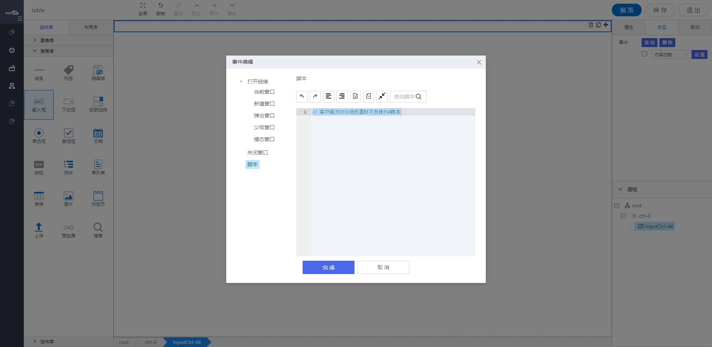
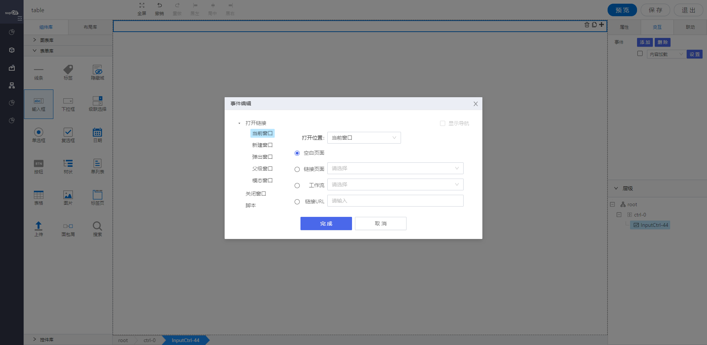
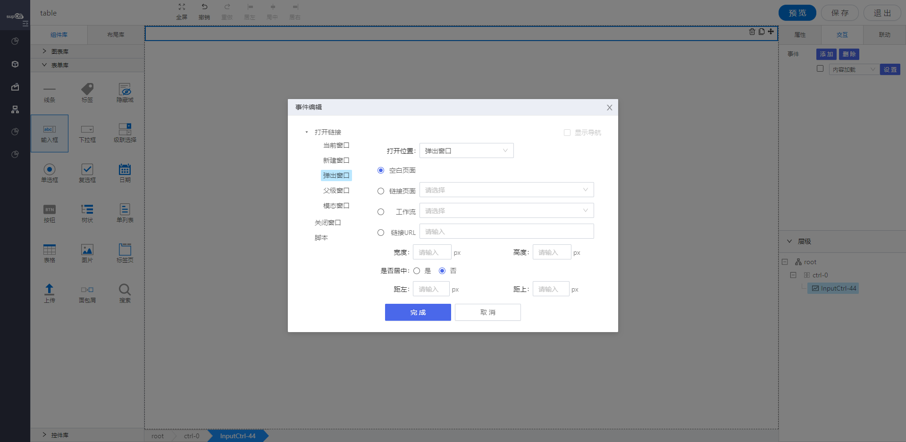
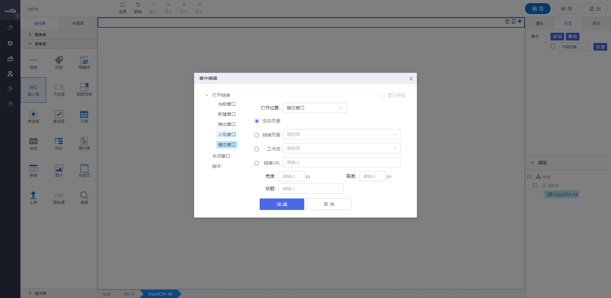

## **交互配置场景介绍**
  - 网格布局的交互
  - 自由布局的交互

  两种布局的交互界面基本一致, 脚本获取元素的方式稍有差别， 详细请看 示例代码


## **交互配置**

{.img-fluid tag=1}

### **交互配置选项**
- 打开链接

  - > 当前窗口
  
    配置链接可以酱当前页面替换成配置页面。
    
    {.img-fluid tag=1}

  - > 新建窗口

    配置链接可以新建链接页面。
    配置项与当前窗口一致
  
  - > 弹出窗口

    配置链接可以弹出一个窗口，显示链接页面。
    {.img-fluid tag=1}

  - > 父级窗口

    配置链接可以改变父级窗口的内容。
    配置项与当前窗口一致

  - > 模态窗口

    配置链接可以改变父级窗口的内容。
    {.img-fluid tag=1}

- 关闭窗口
  
  关闭当前窗口;

- > 脚本

### **交互事件配置选项**

#### **网格布局 - 交互事件**
| 事件名         | 事件描述                                   | 事件支持控件    |
| :------------- | :----------------------------------------- | :-------------- |
| 组件加载完成   | 用于图表的组件加载完成之后                 | 所有图表控件    |
| 单击数据源     | 用于图表的组件， 单击数据源触发            | 所有图表控件    |
| 双击数据源     | 用于图表的组件，双击数据源触发             | 所有图表控件    |
| 内容加载       | 用于表单的组件， 内容加载之后触发          | 所有表单控件    |
| 内容改变       | 用于表单的组件，内容加载之后触发           | 大部分表单控件  |
| 单击           | 用于表单的组件，单击触发                   | 按钮 / 树型控件 |
| 选中           | 用于表单的组件，单击选中触发               | 单列表          |
| 上传完成       | 用于表单的组件，单击选中触发               | 上传控件        |
| 获得焦点       | 用于表单的组件，获得焦点的时候触发         | 搜索控件        |
| 失去焦点       | 用于表单的组件，失去焦点的时候触发         | 搜索控件        |
| 工作流获取数据 | 用于工作流页面（需要启用工作流）, 获取数据 | Root层级        |
| 工作流提交数据 | 用于工作流页面（需要启用工作流）, 提交数据 | Root层级        |
| 工作流驳回数据 | 用于工作流页面（需要启用工作流）, 驳回数据 | Root层级        |


#### **自由布局-交互事件**

| 事件名         | 事件描述                                   | 事件支持控件      |
| :------------- | :----------------------------------------- | :---------------- |
| 组件加载完成   | 用于图表的组件加载完成之后                 | 所有图表控件      |
| 单击数据源     | 用于图表的组件， 单击数据源触发            | 所有图表控件      |
| 双击数据源     | 用于图表的组件，双击数据源触发             | 所有图表控件      |
| 内容加载       | 用于表单的组件， 内容加载之后触发          | 所有控件          |
| 内容改变       | 用于表单的组件，内容加载之后触发           | 大部分表单控件    |
| 单击           | 用于表单的组件，单击触发                   | 按钮 / 树型控件   |
| 双击           | 用于表单的组件，双击击选中触发             | 按钮              |
| 选中           | 用于表单的组件，单击选中触发               | 单列表            |
| 上传完成       | 用于表单的组件，单击选中触发               | 上传控件          |
| 获得焦点       | 用于表单的组件，获得焦点的时候触发         | 搜索控件          |
| 失去焦点       | 用于表单的组件，失去焦点的时候触发         | 搜索控件          |
| 工作流获取数据 | 用于工作流页面（需要启用工作流）, 获取数据 | 画布/ 图表 / 表单 |
| 工作流提交数据 | 用于工作流页面（需要启用工作流）, 提交数据 | 画布/ 图表 / 表单 |
| 工作流驳回数据 | 用于工作流页面（需要启用工作流）, 驳回数据 | 画布/ 图表 / 表单 |


### **示例代码**

#### **公共scriptUtil Api**： [ScriptUtil Api](./scriptUtil.md)

#### **网格布局 - 脚本获取元素的方式**
```javascript
方法一： 适用于当前组件的交互脚本

var input1= instance; // instance 默认为当前元素
input1.setValue(self.getValue()); // 设置Id为Input-1的元素的值为当前元素的值


方法二：适用于所有交互脚本（异步获取）

var input2= window.supQuery.getAsyncInstance('Input-1') // 获取Id为Input-1的元素
input2.then((el) => {
	el.setValue(el.getValue())
}); // 设置Id为Input-1的元素的值为当前元素的值


方法三：适用于除内容加载交互之外的交互。

var input3 = window.supQuery.getInstanceById('Input-1') // 获取Id为Input-1的元素
input3.setValue('1');

```

#### **自由布局 - 脚本获取元素的方式**
```javascript
  var input = scriptUtil.getRegisterReactDom('XXX');
```


