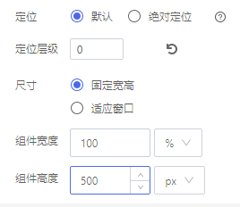

## **统一属性栏配置**

{.img-fluid tag=1}

## **说明**

新设计器普通组件统一的属性设置

#### **属性配置**

| 属性     | 描述信息                 | 类型   | 默认值   | 设值方法            | 取值方法      |
| :------- | :----------------------- | :----- | -------- | ------------------- | ------------- |
| 定位     | 设置定位模式             | string | relative | setPosition(string) | getPosition() |
| 定位层级 | 设置定位层级             | string |          | setZIndex(string)   | getZIndex()   |
| 尺寸     | 设置区块的尺寸类型和宽高 | Object |          | setSizeType(Object) | getSizeType() |

#### **示例代码**

设置尺寸

```javascript
instance.setSizeType({
  ...this.getConfig(), // 已有属性
  sizeType: "min", // 尺寸类型 固定宽度： stable, 适应窗口 auto
  style: {
    ...this.getConfig().style, // 已有样式
    width: "100%", // 宽度
    height: "100px", // 高度
  },
});
```
