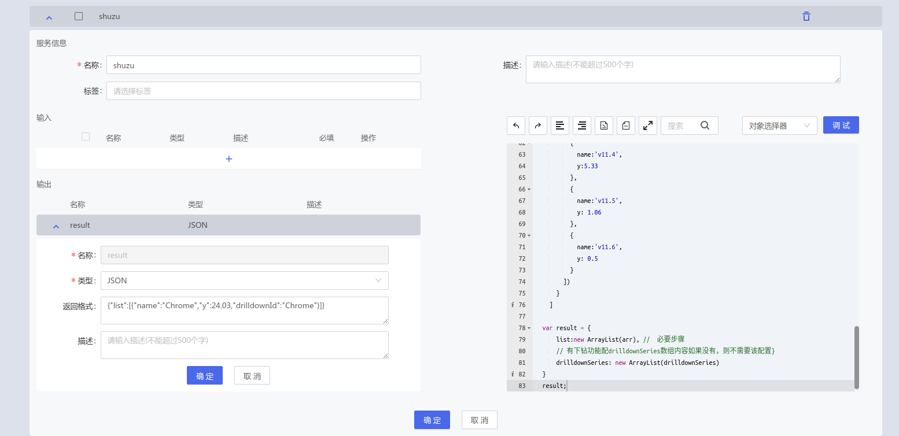
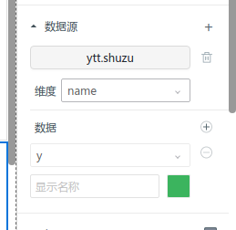

# 数据源样例

### 一、图表控件

#### **图表通用接收格式(除速度仪/仪表盘)**

##### 服务脚本：

```javascript
  var ArrayList = Java.type("java.util.ArrayList");　// 必要配置
  var  arr = [
    // 属性名不一定要name和y,可自行设置，返回值对应即可：
    // {"total":5,"woman":41,"month":"1月","man":55},
    // 如有下钻,则必填drilldownId参数,该参数对应drilldownSeries内id
    //　所有数组必须使用new ArrayList()转换
    {"name":'Chrome',"y":24.03,"drilldownId":"Chrome"},
    {"name":'Firefox',"y":24.03,"drilldownId":"Firefox"},
    {"name":'Safari',"y":24.03,"drilldownId":"Safari"},
    {"name":'Opera',"y":24.03,"drilldownId":"Opera"},
    {"name":'Proprietary or Undetectable',"y":24.03,"drilldownId":null},
  ];
  var  drilldownSeries =  [
      {
        name: 'Chrome', // 可选填
        id: 'Chrome', // 同步drilldown值,否则无法下钻
        data: new ArrayList([ // 该列配置固定,不可改
          {
            name:'v11.0', // x轴刻度值
            y:24.13, // y轴刻度值
            drilldown: 'ChromeV11.0'
          },
          {
            name:'v8.0',
            y:17.2
          },
          {
            name:'v9.0',
            y: 8.11
          },
          {
            name:'v10.0',
            y:5.33
          },
          {
            name:'v6.0',
            y: 1.06
          },
          {
            name: 'v7.0',
            y: 0.5
          }
        ])
      },
      {
        name: 'ChromeV11.0', // 可选填
        id: 'ChromeV11.0', // 同步drilldownId值,否则无法下钻
        data: new ArrayList([ // 该列配置固定,不可改
          {
            name:'v11.1', // x轴刻度值
            y:24.13, // y轴刻度值
          },
          {
            name:'v11.2',
            y:17.2
          },
          {
            name:'v11.3',
            y: 8.11
          },
          {
            name:'v11.4',
            y:5.33
          },
          {
            name:'v11.5',
            y: 1.06
          },
          {
            name:'v11.6',
            y: 0.5
          }
        ])
      }
    ]
  
  var result = {
      list:new ArrayList(arr), //　必要步骤
      // 有下钻功能配drilldownSeries数组内容如果没有，则不需要该配置
      //　drilldownSeries该值供下钻使用，请避开次关键词
      drilldownSeries: new ArrayList(drilldownSeries)
  }
  result;

```

##### 返回值：

```javascript
  
  //　注意事项：保证所有列表返回格式正确,不能出现对象情况，否则无法正确显示图表
  {
    "list": [
      { "name": "Chrome", "y": 24.03, "drilldownId": "Chrome" }, // x轴刻度值 y轴值　下钻id
      { "name": "Firefox", "y": 24.03, "drilldownId": "Firefox" },
      { "name": "Safari", "y": 24.03, "drilldownId": "Safari" },
      { "name": "Opera", "y": 24.03, "drilldownId": "Opera" },
      { "name": "Proprietary or Undetectable", "y": 24.03 }
    ],
    "drilldownSeries": [
      {
        "name": "Chrome", // 可选填
        "id": "Chrome", // 同步drilldownId值,否则无法下钻
        "data": [
          { "name": "v11.0", "y": 24.13, "drilldown": "ChromeV11.0" },
          { "name": "v8.0", "y": 17.2 },
          { "name": "v9.0", "y": 8.11 },
          { "name": "v10.0", "y": 5.33 },
          { "name": "v6.0", "y": 1.06 },
          { "name": "v7.0", "y": 0.5 }
        ]
      },
      {
        "name": "ChromeV11.0",
        "id": "ChromeV11.0",
        "data": [
          { "name": "v11.1", "y": 24.13 },
          { "name": "v11.2", "y": 17.2 },
          { "name": "v11.3", "y": 8.11 },
          { "name": "v11.4", "y": 5.33 },
          { "name": "v11.5", "y": 1.06 },
          { "name": "v11.6", "y": 0.5 }
        ]
      }
    ]
  }

```

##### 输出配置：

```javascript

//　将调试结果复制，修改＇输出＇类型为＇JSON＇，并将复制结果粘贴到返回格式中，效果如图：

```

{.img-fluid tag=1}

##### 输出配置使用出：

```javascript

//　服务中如果配置输出，组态期可直接选择参数
// 需要添加数据源前处理号'输出'配置,如果在添加数据源后配置，需要重新添加该数据源

```

{.img-fluid tag=1}

#### **速度仪/仪表盘接收格式**

##### 服务脚本：

```javascript

  41

```

##### 返回值：

```javascript
   {
     AAAA_YTT.mockNumber: 41
   }
```

### 二、表单控件

#### **下拉框/单选/复选/单列表 数据接收格式**

##### **服务脚本**
```javascript
  var ArrayList = Java.type("java.util.ArrayList");
  var list = [
      {
          optionText: '男',  // 显示文本
          optionValue: '1'  // 选中值
      },
      {
          optionText: '女',
          optionValue: '2'
      }
  ];
  
  result = {
    list: new ArrayList(arr)
  }
```

##### **返回参数**
```javascript
   {
    list： [
        {
            optionText: '男',  // 显示文本
            optionValue: '1'  // 选中值
        },
        {
            optionText: '女',
            optionValue: '2'
        }
    ]
   }
```

#### **级联数据接收格式**

##### **服务脚本**
```
var ArrayList = Java.type("java.util.ArrayList");
var list = [
    {
      value: "zhejiang",
      label: "Zhejiang",
      children: new ArrayList([
        {
          value: "hangzhou",
          label: "Hangzhou",
          children: new ArrayList([
            {
              value: "xihu",
              label: "West Lake"
            }
          ])
        }
      ])
    },
    {
      value: "jiangsu",
      label: "Jiangsu",
      children: new ArrayList([
        {
          value: "nanjing",
          label: "Nanjing",
          children: new ArrayList([
            {
              value: "zhonghuamen",
              label: "Zhong Hua Men"
            }
          ])
        }
      ])
    }
  ]
  
  result = {
    list: new ArrayList(list)
  }
```

##### **返回格式**
```javascript
{
  list: [
    {
      value: "zhejiang",
      label: "Zhejiang",
      children: [
        {
          value: "hangzhou",
          label: "Hangzhou",
          children: [
            {
              value: "xihu",
              label: "West Lake"
            }
          ]
        }
      ]
    },
    {
      value: "jiangsu",
      label: "Jiangsu",
      children: [
        {
          value: "nanjing",
          label: "Nanjing",
          children: [
            {
              value: "zhonghuamen",
              label: "Zhong Hua Men"
            }
          ]
        }
      ]
    }
  ];
}
```

#### **树形控件数据接收格式**

##### **服务脚本**
```
var ArrayList = Java.type("java.util.ArrayList");
var list = [
    {
      id: "1",
      name: "父级1",
      children: new ArrayList([
        {
          id: "1-1",
          name: "子级1"
          children: new ArrayList([
            {
              id: "1-1-1",
              name: "子级1-1"
            }
          ])
        }
      ])
    },
    {
      id: "2",
      name: "父级2",
      children: new ArrayList([
        {
          id: "2-1",
          name: "子级2"
          children: new ArrayList([
            {
              id: "2-1-1",
              name: "子级2-1"
            }
          ])
        }
      ])
    }
  ]
  
  result = {
    list: new ArrayList(list)
  }
```
##### **返回格式**

```javascript
{
  list: [
    {
      id: "1",
      name: "父级1",
      children: [
        {
          id: "1-1",
          name: "子级1"
        }
      ]
    },
    {
      id: "2",
      name: "父级2",
      children: [
        {
          id: "2-1",
          name: "子级2"
        }
      ]
    }
  ];
}
```

#### **表格配置**

##### **服务脚本**
```
var ArrayList = Java.type("java.util.ArrayList");
var list = [
    {
        key1: '1',
        key2: 'H111',
        name:'集装箱',
        nickName: '物料名称',
        request: 1
    },
    {
        index: '3',
        id: 'H112',
        name: '垃圾箱',
        nickName: '物料名称',
        request: 1
    },
    {
        index: '2',
        id: 'H110',
        name: '集装箱',
        nickName: '物料名称',
        request: 1
    },
    {
        index: '4',
        id: 'H111',
        name: '工业箱',
        nickName: '物料名称',
        request: 1
    }
]
  
  result = {
    list: new ArrayList(list)，
    pagination: {
      current:1,
      pageSize:1,
      total:5
    }
  }
```
##### **返回格式**
```javascript
    {
        list: [
            {
                key1: '1',
                key2: 'H111',
                name:'集装箱',
                nickName: '物料名称',
                request: 1
            },
            {
                index: '3',
                id: 'H112',
                name: '垃圾箱',
                nickName: '物料名称',
                request: 1
            },
            {
                index: '2',
                id: 'H110',
                name: '集装箱',
                nickName: '物料名称',
                request: 1
            },
            {
                index: '4',
                id: 'H111',
                name: '工业箱',
                nickName: '物料名称',
                request: 1
            },
        ],
        // 需要分页加分页信息，不需要就不加
        pagination: {
            current:1,
            pageSize:1,
            total:5
        }
    }
```

#### **标签页配置**
##### **服务脚本**
```
var ArrayList = Java.type("java.util.ArrayList");
var list = [
  {
    key: '22',
    optionText: '22',
    optionValue: '22',
    optionPageValue:
      '/#/runtime-fullscreen/runtime-fullscreen/Page_ed044f58b9d147b99d0855be2b3e0cc2',
    optionPageLabel: ['qqq'],
  },
  {
    key: '33',
    optionText: '33',
    optionValue: '33',
    optionPageValue:
      '/#/runtime-fullscreen/runtime-fullscreen/Page_0eb38d72c06147fb9cb12028b1b1e0e9',
    optionPageLabel: ['日期'],
    name: '日期',
  }
];
  
result = new ArrayList(list)
```
##### **返回数据**
```javascript
[
  {
    key: '22',
    optionText: '22',
    optionValue: '22',
    optionPageValue:
      '/#/runtime-fullscreen/runtime-fullscreen/Page_ed044f58b9d147b99d0855be2b3e0cc2',
    optionPageLabel: ['qqq'],
  },
  {
    key: '33',
    optionText: '33',
    optionValue: '33',
    optionPageValue:
      '/#/runtime-fullscreen/runtime-fullscreen/Page_0eb38d72c06147fb9cb12028b1b1e0e9',
    optionPageLabel: ['日期'],
    name: '日期',
  },
]
```


#### **面包屑代码**

##### **服务脚本**
```javascript
var ArrayList = Java.type("java.util.ArrayList");
var list = [
  {
      key: 'item1',  // key标识
      text: '首页',  // 显示名称
      fontSize: 17,  // 字体大小
      color: 'red',  // 字体颜色
      fontFamily: '微软雅黑', // 字体
      fn: function() {}, // 点击该项回调方法
  }
];
  
result = new ArrayList(list)

```

##### **返回数据**
```javascript
[
      {
          key: 'item1',  // key标识
          text: '首页',  // 显示名称
          fontSize: 17,  // 字体大小
          color: 'red',  // 字体颜色
          fontFamily: '微软雅黑', // 字体
          fn: function() {}, // 点击该项回调方法
      }
  ]
```

### 三、控件库

#### **趋势控件**

```javascript
[
  {
    color:"#3073D6", // 必填,颜色
    maxValue:1000, // 最大量程
    minValue:0, // 最小量程
    name:"a_1111:miter_1",  // 必填,对项名+属性名
    primitiveType:"Double",  // 必填,属性类型
    unit:null // 单位
  }
]
```

#### **视频控件**

```javascript
[
    {
        interval:30,
        name:"guanwei",
        source:"guanwei/hisvideo"
    }
]
```
