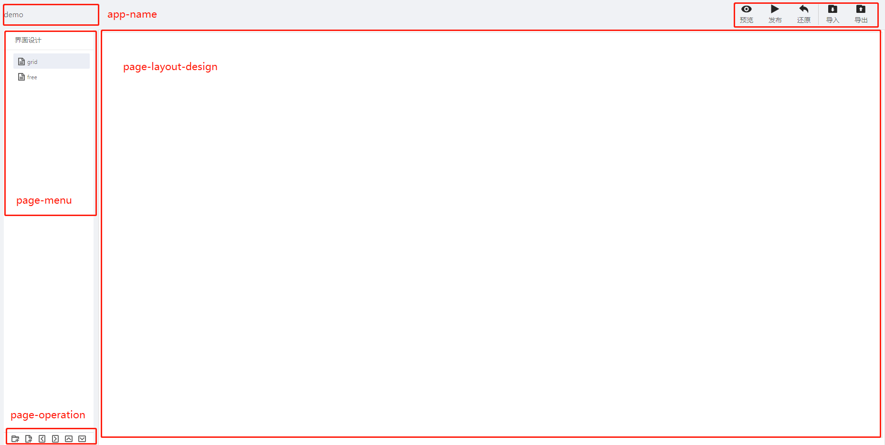
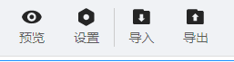
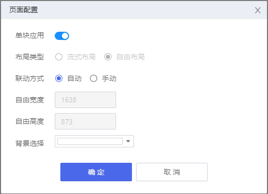
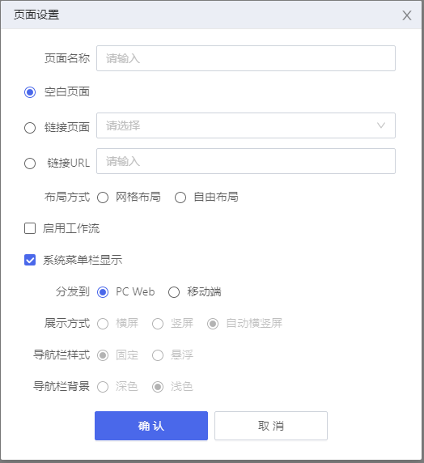

## **界面设计器**

### **界面介绍**

**网格布局**
{.img-fluid tag=1}

自由布局的页面工具栏有些许不同

{.img-fluid tag=1}

#### **布局解释**
> app-name --- 创建的app名称 
>
> page-menu --- 创建页面树状图，可创建文件夹、页面 
>
> _ps:可实现编辑页面信息、复制该页面、删除该页面_
>
> page-operation ---- 新增页面、文件夹、等级提升、等级降低、向上移动、向下移动 
>
> _ps: 等级提升、等级降低可实现一级菜单和二级菜单的转换；向上向下移可改变树状结构的排列顺序_
>
> page-feature --- 导出和导入页面、预览组态页面、页面配置项、全屏功能，发布，还原
> _ps: 发布还原是网格布局特有功能， 页面配置为自由布局独有_
>
> page-layout-design --- 设计页面上区块（画布）信息，对页面进行分区，在各个分区中编辑相应的控件信息

#### **自由布局的页面配置**
{.img-fluid tag=1}

> 单块应用：只能配置一个画布，
> 
> 非单块应用： 可以同时配置多个画布
> 

> 非单块应用的布局模式
> 
>    1).流式布局：文档流模式处理模块位置
> 
>    2).自由布局：用户自定义模块位置

> 联动方式
> 
> 自动：自动触发组件联动
> 
> 手动：需要点击按钮触发联动
> 

### **新增页面**

{.img-fluid tag=1}

页面名称和布局方式必须填写，否则无法新建页面。

> 网格布局: 采用文档流模式开发，先布局再填充组件的方式创建页面。
> 
> 自由布局：采用图形绘制模式，直接拖放组件创建页面。