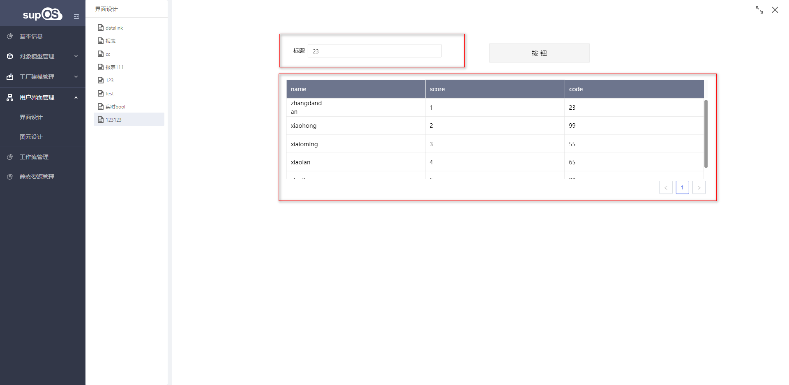

## **联动配置**

> 设计器有两种联动：
>
> [1.自由布局联动](#free)
>
> [2.网格布局的联动](#grid)

### <u id='free'>**自由布局联动**</u>

> 联动是用于输入组件与输出组件进行数据请求的一种方式，用户查询服务，历史数据，报表 sql 等
>
> 1）输入组件
>
> 输入框，时间控件，单选框，多选框，等一系列可输入控件
>
> 2）输出组件
>
> 报表，图表，表格等可接受数据，并进行展示的组件

#### **使用方法**

> 1）自动联动
>
> 自动联动：输入控件改变值时，进行数据发送

{.img-fluid tag=1}

> 例子：
>
> 1. 新建输入框控件，表格，填写控件名称（必须）
>    {.img-fluid tag=1}
>
> 2. 点击输出控件，选择数据源
>    {.img-fluid tag=1}
>
> 3. 点击联动对象，可看到有我们所绑定数据源的入参，以及，给入参设置的初始值，以及我们目前可以绑定的组件
>    {.img-fluid tag=1}
>
> 4. 预览
>    {.img-fluid tag=1}
>
> 5. 更改输入框的值，例如输入“23”, 则表格中删选出 code 为 23 的值
>    {.img-fluid tag=1}

> 2）手动联动：输入控件改变值也不进行数据发送，需要点击绑定的按钮
>
> 不同点：设置联动方式为手动联动
>
> {.img-fluid tag=1}
>
> 1. 需要页面拖入按钮组件，我们设置控件名称为 button，用表格对按钮进行绑定
>    {.img-fluid tag=1}
>
> 2. 我们输入框改变值为"23"，此时表格不在自动筛选，需要点击按钮才能筛选出
>    {.img-fluid tag=1}

#### **联动规则**

> 1）控件名称必须填写
>
> 2）手动联动需要绑定按钮，否则无法进行查询
>
> 3）联动可进行初始值设置

{.img-fluid tag=1}
{.img-fluid tag=1}

#### **特殊场景**

> 说明：在应用场景中，有需要某个字段自动联动，其余字段手动联动情况。
>
> 例如：搜索与高级搜索。
>
> 前提：整个画布使用手动联动。
>
> 使用：此场景需要使用脚本绑定需要自动联动的字段。
>
> 方法：scriptUtil.submitDefaultValue(dom,value, tag)
>
> 1. dom: 获取到的控件，可通过 ID 获取，使用 scriptUtil.getRegisterReactDom(ID)；
>
> 2. value: 当前控件的值，可使用 dom.getValue()获取；
>
> 3. tag: '0'为自动，'1'为手动，这个值设置只为当前控件设置，不影响其他
>    {.img-fluid tag=1}

### <u id="grid">**网格布局联动**</u>

> 选择一个可已进行联动配置的组件，以下使用单选框为例
> {.img-fluid tag=1}
>
> 选中“+”号添加动作，选择内容改(单选框选择选项触发)
>
> {.img-fluid tag=1}
>
> 点击选择目标，按钮会高亮，然后在画布上选择需要联动的元素,此处目标例子为表格,不能联动自己。
>
> {.img-fluid tag=1}

> 在选择目标之后会出现三个下拉框选择

| 编辑格式                                                                                                                       | 动作                                           | 第三个字段                                                                                                                                                                                                                                                                                                                                                                                                               |
| ------------------------------------------------------------------------------------------------------------------------------ | ---------------------------------------------- | ------------------------------------------------------------------------------------------------------------------------------------------------------------------------------------------------------------------------------------------------------------------------------------------------------------------------------------------------------------------------------------------------------------------------ |
| 代表单选框切换选中状态时可以根据编辑格式的脚本进行格式编译，使用“value”能够获取单选框返回的完整结构,并提供了几种其他默认的格式 | 代表表格能够执行的操作，不同组件会有不同的动作 | 第三个字段会根据不同的目标展示不同的场景源字段：当作为源的元素执行的联动输出为一个对象，且作为目标的元素选中的动作接收需要一个字符串目标字段：当作为源的元素执行的联动输出是一个字符串，且作为目标的元素选中的动作接收需要一个对象配置结构：当作为源的元素执行的联动输出为一个对象，且作为目标的元素选中的动作接收需要一个对象空：当作为源的元素执行的联动输出为一个字符串，且作为目标的元素选中的动作接收需要一个字符串 |

注意：编辑格式默认会提供一些可能的选项，需要自行判断是否需要转换

> 不同的选项会根据目标和源的数据源动态决定，且只有数据源为服务的时候才能解析
>
> 以下是配置结构，label 和 value 代表源元素的输出结构 { label: '', value: '',}
>
> 下拉选择代表目标的接收结构 { input: '', time: ''}
> {.img-fluid tag=1}

注意：初始化联动 只能配置一级，只能 A→B,不能 A→B→C，由于 A 到 B 去执行的是 B 的请求，B 的初始化不会存在请求的方法里面
