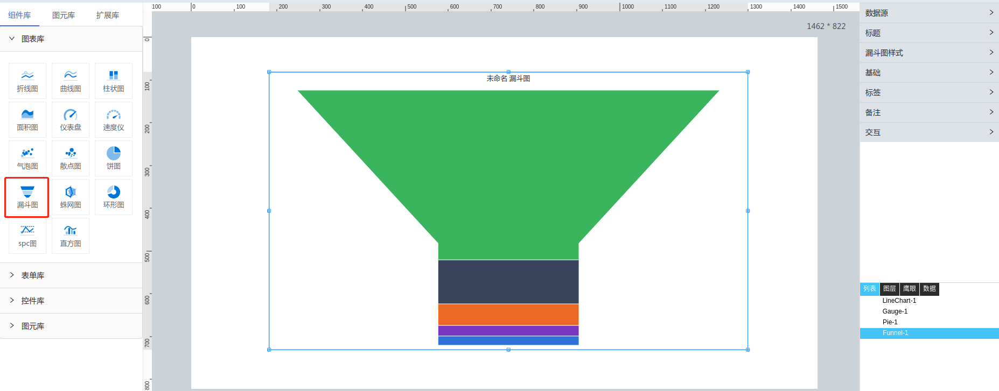

**1\. 基本信息**

{.img-fluid tag=1}

#### **组件简介**

> 名称： 漏斗图
>
> 功能：展现数据变化
>
> 使用场景：全部

#### **图表公共属性配置**： [配置](./chart.md)

#### **漏斗图属性**

| 属性| 描述信息| 类型| 默认值 | 设值方法 | 取值方法|  脚本使用 |
|-----|--------|----|--------|--------|----------|-----|
| 定时刷新 |  | number | undefined | setTimer | getTimer |  |
| 类型 |  | string | 'funnel' | setType | getType | 允许 |
| 样式 |  | object | {  neckWidth:'30%, neckHeight:'30% } | setFunnelNeckSet | getFunnelNeckSet | 允许 |
| 边框颜色 |  | object | {borderColor: '#fff', borderWidth: 2} | setFunnelBorderColorWidth | getFunnelBorderColorWidth | 允许 |