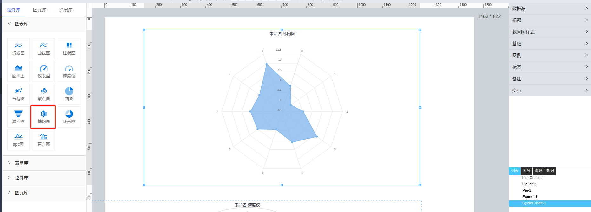

**1\. 基本信息**

{.img-fluid tag=1}

#### **组件简介**

> 名称： 蛛网图
>
> 功能：展现数据变化
>
> 使用场景：全部

#### **图表公共属性配置**： [配置](./chart.md)

#### **蛛网图属性**

| 属性| 描述信息| 类型| 默认值 | 设值方法 | 取值方法|  脚本使用 |
|-----|--------|----|--------|--------|----------|-----|
| 样式 | 线条样式 | object | {lineWidth: 2, dashStyle: 'solid, symbol:'circle', radius:4, fillColor:'#fff'} | setChartDataLine | getChartDataLine | 允许 |
| 不透明度 |  | number | 75 | setRegionTransparency | getRegionTransparency | 允许 |
| 网格颜色 |  | string | '#ddd' | setGridLineColor | getGridLineColor | 允许 |