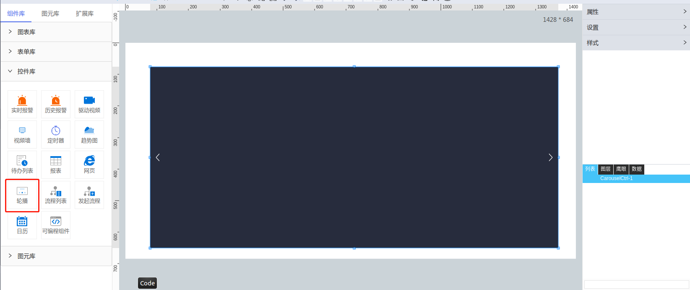

**1\. 基本信息**

{.img-fluid tag=1}


#### **组件简介**

> 名称：轮播图
>
> 功能：滚动播放图片或者内嵌页面
>
> 使用场景：全部

#### **属性配置**

| 属性       | 描述信息       | 类型      | 默认值                                                     | 设值方法            | 取值方法            |
|----------|------------|---------|---------------------------------------------------------|-----------------|-----------------|
| 轮播频率     | 每隔几秒切换页面   | number  | 5                                                       | setSpeed        | getSpeed        |
| 播放源\-类型  |            | string  | 'image'                                                  | setPageType     | getPageType     |
| 播放源\-播放源 |            | array   | \[\]                                                    | setSource       | getSource       |
| 边框       | 调整颜色、线型、线宽 | object  | \{ width: 1, color: '\#272C3D', borderStyle: 'solid' \} | setBorderStyles | getBorderStyles |
| 翻页箭头     | 显示隐藏左右切换箭头 | boolean | true                                                    | setShowArrow    | getShowArrow    |
| 轮播页码     | 显示隐藏底部圆点   | boolean | true                                                    | setShowPoint    | getShowPoint    |

#### **示例代码**

```javascript
  目前不支持任何脚本
```
