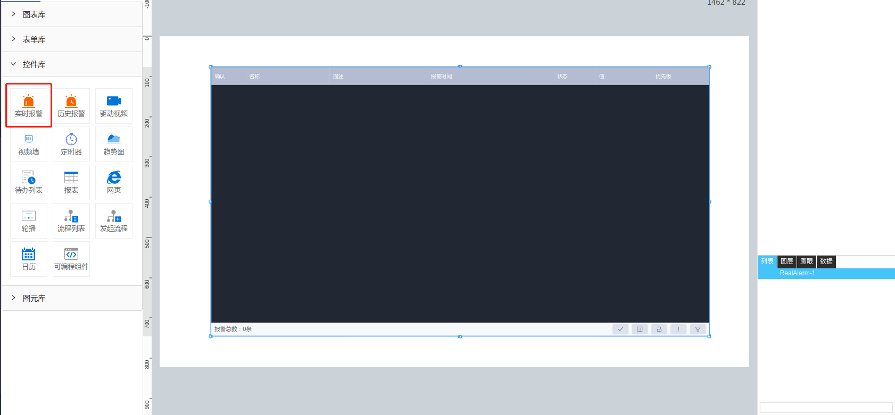

**1\. 基本信息**

{.img-fluid tag=1}


#### **组件简介**

> 名称：实时报警
>
> 功能：查看当前异常数据
>
> 使用场景：全部

#### **属性配置**

| 属性    | 描述信息       | 类型      | 默认值                       | 设值方法                    | 取值方法                    |
| :------ | :--------------- | :----- | ------ | -------------------------- | ---------- |
暂时属性配置


#### **示例代码**

```javascript
  目前不支持任何脚本
```
