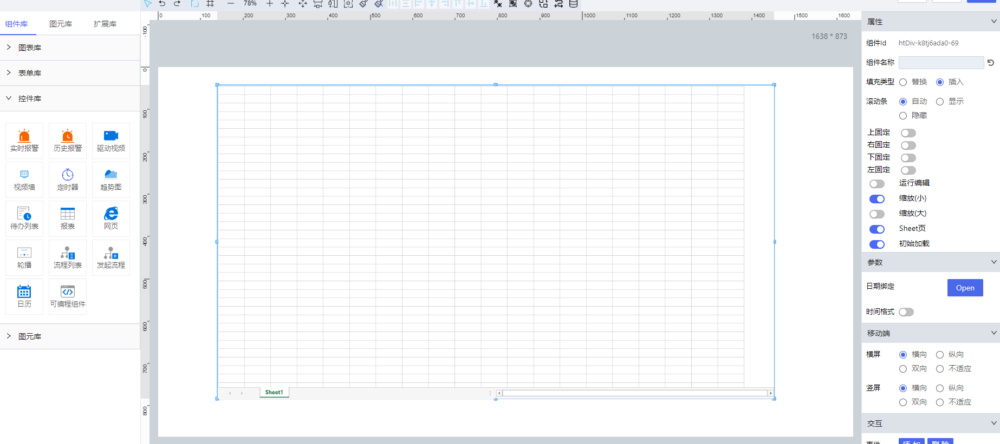

### **1\. 基本信息**


#### **组件简介**
> 名称：输入框
>
> 功能：用于用户输入
> 使用场景：
>&nbsp;&nbsp;1.设计期
> * 绘制报表模板
> * 添加配置数据源
>
>&nbsp;&nbsp;2.组态期
> * 配置报表参数（属性）
> * 绑定联动关系
> * 添加报表事件

#### **属性配置**
| 属性    | 描述信息         | 类型   | 默认值 | 设值方法                   | 取值方法   |
| :------ | :--------------- | :----- | ------ | -------------------------- | ---------- |
| 组件 ID | 控件 ID 自动生成 | string |        |                          |            |
| 组件名称    | 联动组件列表显示的名称       | string |  | setFormItemId | getFormItemId |
| 填充类型 | 数据源填充类型, 插入(insert)、替换(replace) | string | 插入(insert) | setFillDataType |  getFillDataType |
| 滚动条 | 是否显示滚动条, 自动(auto)、显示(visiable)、隐藏(hidden) | string | 自动(auto) | setScrollbarVisible | getScrollbarVisible |
| 上固定 | 固定画布上部 | boolean | false | setPosition('topEnable', value) | getPosition |
| 右固定 | 固定画布右部 | boolean | false | setPosition('rightEnable', value) | getPosition |
| 下固定 | 固定画布下部 | boolean | false | setPosition('bottomEnable', value) | getPosition |
| 左固定 | 固定画布左部 | boolean | false | setPosition('leftEnable', value) | getPosition |
| 运行编辑 | 运行期是否可编辑单元格 | boolean | false | setRunTimeEdit | getRunTimeEdit |
| 缩放(小) | 流式布局下小屏幕缩放适应 | boolean | true |  setRunTimeZoomSheet | getRunTimeZoomSheet |
| 缩放(大) | 流式布局下报表列撑满 | boolean | true |  setRunTimeZoomLargeSheet | getRunTimeZoomLargeSheet |
| Sheet页 | 运行期是否显示sheet页 | boolean | true | setRunTimeShowSheet | getRunTimeShowSheet |
| 初始加载 | 初始化是否请求数据 | boolean | true | setInitLoadData | getInitLoadData | 

#### **示例代码**

```javascript
  // 获取Id为htDiv-k8tj6ada0-704的元素
  var reporterCtrl = window.supQuery.getInstanceById('htDiv-k8tj6ada0-704'); 

  // 组件名称
  reporterCtrl.setFormItemId('ReporterCtrl');
  const reporterName = reporterCtrl.getFormItemId();

  // 填充类型
  reporterCtrl.setFillDataType('replace');
  const fillDataType = reporterCtrl.getFillDataType();

  //  滚动条
  reporterCtrl.setScrollbarVisible('auto');
  const scrollbarVisible = reporterCtrl.getScrollbarVisible();

  // 上固定
  reporterCtrl.setPosition('topEnable', true);
  const topEnable = reporterCtrl.getPosition()['topEnable'];

  // 下固定
  reporterCtrl.setPosition('bottomEnable', true);
  const bottomEnable = reporterCtrl.getPosition()['bottomEnable'];

  // 左固定
  reporterCtrl.setPosition('leftEnable', true);
  const leftEnable = reporterCtrl.getPosition()['leftEnable'];

  // 右固定
  reporterCtrl.setPosition('rightEnable', true);
  const rightEnable = reporterCtrl.getPosition()['rightEnable'];

  //  运行可编辑
  reporterCtrl.setRunTimeEdit(true);
  const runTimeEdit = reporterCtrl.getRunTimeEdit();

  //  缩放(小)
  reporterCtrl.setRunTimeZoomSheet(true);
  const runTimeZoomSheet = reporterCtrl.getRunTimeZoomSheet();

    //  缩放(大)
  reporterCtrl.setRunTimeZoomLargeSheet(true);
  const runTimeZoomLargeSheet = reporterCtrl.getRunTimeZoomLargeSheet();

    //  Sheet页
  reporterCtrl.setRunTimeShowSheet(true);
  const runTimeShowSheet = reporterCtrl.getRunTimeShowSheet();

    //  运行可编辑
  reporterCtrl.setInitLoadData(true);
  const initLoadData = reporterCtrl.getInitLoadData();

```

---

### **2\. 功能详解**
#### **绘制报表模板**

##### **菜单栏-开始**
| 属性  |  描述 |
| ---  | :--- |
| 打开  |   导入Excel文件 |
| 导出  |  导出为xlsx或cvs格式文件 |
| 打印  |  打印sheet页 |
| 保存  |  保存报表修改信息 |
| 复制  |  复制单元格信息(包含值, 公式, 样式) |
| 剪切  |  剪切单元格信息 |
| 粘贴  |  粘贴单元格信息, 全部粘贴、公式、值、格式 |
| 格式刷 | 便捷粘贴单元格格式,  双击可连续对多个单元格设置 |
| 字体、字号  |  设置单元格字体、字号 |
| 字形  |  设置单元格加粗、倾斜、下划线 |
| 对齐方式  |   设置单元格对齐方式：向左、垂直居中、向右、向下、水平居中、向右 |
| 字体、背景颜色  |   设置单元格字体、背景颜色 |
| 边框 | 设置单元格边框：外框线、内框线、全框线、左框线、右框线、上框线、下框线、垂直框线、水平框线、右斜线、左斜线、无框线 |
| 清除 | 清除单元格样式、内容 |
| 合并居中 | 合并单元格并居中 |
| 自动换行 | 设置单元格自动换行 |
| 条件格式 | 设置所选单元格区域高亮规则 |
| 基本函数 | 添加单元格基本函数：求和、平均数、计数、最大值、最小值 |
| 筛选-筛选 | 设置所选区域筛选条件，与右键菜单-筛选相同 |
| 筛选-高级过滤 | 对数据源动态设置筛选条件 |
| 排序 | 设置所选区域递升序、降序，与右键菜单-排序相同 |
| 单元格格式 | 与右键菜单-设置单元格格式相同 |
| 行和列 | 设置单元格行高、最适行高、列宽、最适列宽 |
| 行和列-插入、删除单元格 | 插入行、列，删除行、列，与右键菜单-插入、删除相同 |
| 冻结窗格 | 冻结首行、首列、指定行列、尾部窗格 |
| 模拟分析 | 单变量求解 |

#### **菜单栏-插入**
| 属性 | 描述 |
| ---  | :--- |
| 插入图表 | 在sheet中插入图表：折线图、饼图、柱状图、条形图 |
| 行、列 | 与菜单行和列一致 |
| 插入图片 | 在sheet中插入图片 |
| 插入数据源 | 展示插入数据源右侧菜单 |

#### **右键菜单**
| 属性 | 描述 |
| ---  | :--- |
| 复制  | 与菜单栏-开始-复制相同 |
| 粘贴  | 与菜单栏-开始-粘贴相同 |
| 清除  | 与菜单栏-开始-清除相同 |
| 过滤  | 与菜单栏-开始-过滤相同 |
| 排序  | 与菜单栏-开始-排序相同 |
| 插入批注  | 设置单元格批注 |
| 单元格格式  | 与右键菜单-设置单元格格式相同 |
| 插入公式 | 插入历史/实时数据源、实时统计、内置函数 |

#### **设置单元格格式**
| 属性   |  描述 |
| ---    | :--- |
| 数字 | 类型：常规、数字(可设置小数位数)、文本、日期、货币、百分号、自定义 |
| 边框设置 | 边框属性：线条样式、颜色、边框类型 |
| 图案 | 背景颜色 |
| 类型 | 单元格默认为编辑框，可设置为列表框 |
| 对齐 | 设置文本对齐方式：水平、垂直，设置文本控制：自动换行、文字竖排 |
| 字体 | 设置字体、字形、字号、颜色、删除线、下划线 |
| 权限 | 为不同角色在运行期配置不同的权限：读写(**<span style="color: red">目前仅对历史/实时数据的公式有效</span>**)、只读、隐藏 |

#### **高级过滤**

| 属性   |  描述 |
| ---    | :--- |
| 可选列 | 列名、序列号, 数据是来自服务的数组或来自关系数据库的字段 |
| 操作符 | 等于、不等于、大于、大于或等于、小于、小于或等于、开头是、开头不是、结尾是、结尾不是、包含、不包含、包含于、不包含于 |
| 值类型 | 字符串、日期、单元格、数据列、整型, 浮点型, 布尔型 |
| 父格条件 | 默认为是, 为是时子格将自动继承父格条件, 子格的过滤为自身条件加上父格条件 |

##### **功能解析**
*可在报表中设置过滤条件，运行时按照设定的条件对数据源数据过滤*

1、可选列：可以是来自服务的数组或来自关系数据库的字段，即可对来自服务的数组、来自关系数据库的字段设置过滤
&nbsp;&nbsp;&nbsp;&nbsp;列名：用数据集的字段名字表示过滤的列
&nbsp;&nbsp;&nbsp;&nbsp;序列号：列名在记录集中排列的序号，报表自动添加的字段不参与排序，只有记录集本身的序号参与排序，排序号从1开始，最大序号为记录集本身的字段数量

2、可多个过滤条件之间通过”与”和“或”连接。通过“与”连接时，过滤的结果为连接的条件“与”后的集合；通过“或”连接时，过滤的结果为连接的条件“或”后的集合；

3、不同的条件可增加（）操作符，也可去除（）操作符


4、由于单元格的计算顺序，过滤条件需要设置在单元格的父格上，其子格会自动继承父格条件，将父格子作为过滤条件

5、在父窗格已经设置了过滤条件的情况下，子格也设置了过滤条件，子窗格的过滤条件为父、子窗格条件的叠加。


---

### **3\. 添加配置数据源**
#### **数据源类型**
| 类型 | 描述 |
| ---  | :--- |
| 对象实例 | 历史、实时数据 |
| 表格数据 | 内置数据库（MySQL）、外部数据源（MySQL、Oracle）查询结果 |
| 服务 | 对象实例中的服务 |
| 实时统计 | 实时统计的数据 |

#### **添加对象实例步骤**
- 选择对象实例
- 勾选对象实例（多选）
- 从数据源列表中拖拽相应的属性到报表中

##### **或者**
- 右键菜单 - 插入公式 - 数据源
- 选择单个数据源（实例-属性）


#### **配置对象实例**
| 属性   |  描述 |
| ---    | :--- |
| 数据源 | 对象选择器 |
| 数据类型 | 实时（默认）、历史 |
| 显示类型 | 历史数据的值显示类型, 显示时间、显示值(默认) |
| 时间粒度 | 秒（默认）、分、时、日、周、月、年 |
| 数值类型 | 平均值、最大值、最小值、求和（默认）、瞬时值 |
| 填充方向 | 自动填充：纵向填充（默认）、横向填充 |
| 最大个数 | 1-500（默认为500）|
| 统计序号 | 填充固定序号，1-500（默认为1）|


#### **添加表格数据步骤**
- 选择数据查询
- 选择外部数据源（默认为内置数据源）
- 输入SQL查询语句（可预览查询结果）
- SQL语句中的入参变量用 ”${变量名}” 表示
- 输入查询结果的数据源名称
- 确认后可在数据源列表中看到SQL查询的结果集结构
- 从数据源列表中拖拽相应的列到报表中


#### **配置表格数据**
| 属性   |  描述 |
| ---    | :--- |
| 数据源 | 结果集列名 |
| 指定主键 | 指定表格回填时的sql语句主键 |
| 填充方向 | 纵向填充（默认）、横向填充 |
| 最大个数 | 1-200（默认为200） |
| 填充合并 | 是否合并（默认合并） |
| 类型转换 | 值类型格式化 |


#### **添加服务步骤**
- 选择添加服务
- 选择一个实例，勾选服务（多选）
- 从数据源列表中拖拽相应的列到报表中


#### **配置服务**
| 属性   |  描述 |
| ---    | :--- |
| 数据源 | 结果集列名
| 填充方向 | 纵向填充（默认）、横向填充 |
| 最大个数 | 1-500（默认为500）|
| 填充合并 | 是否合并（默认否）|


#### **添加序号**
- 有填充长度的公式，如历史数据、表格数据、服务数据在添加到数据源列表时会自动生成一项名称为 ”_key_” 来展示实际生成数据的序号，如下图为运行期展示结果。
- **实时数据不会生成序号**


#### **添加日期函数步骤**
- 右键菜单 
- 插入公式 
- 内置函数

#### **配置日期函数**
| 属性   |  描述 |
| ---    | :--- |
| 时间粒度 | 时、日（默认）、月、年 |
| 日期格式 | 根据不同的时间粒度，有不同类型的日期格式 |
| 填充方向 | 纵向填充（默认）、横向填充 |


#### **设置父窗格**


- 填充方式为插入
- 设置的目标父窗格一般为某个有填充数量的公式，例如生成历史数据公式，表格数据公式，服务数据公式，日期函数
- 选中需要设置父窗格的单元格（子单元格），在父窗格配置区域中选择自定义，填写目标父窗格所在的行号和列号


- 合并（表格数据、服务数据）中使用父窗格
  - 默认填充方向上相邻单元格内容相同时会自动合并（左图）
  - 在父窗格的合并区域内，子窗格才会合并（右图中staff_name列）


#### **设置聚合公式**
- 仅设置基本函数：计算区域不会发生变化时能获取正确值
- 基本函数 + 设置聚合公式 + 插入填充：根据填充的内容计算值
- 基本函数类型：求和（SUM）、平均（AVERAGE）、计数（COUNT）、最大值（MAX）、最小值（MIN）


### **4.绑定联动关系(参数)**
- 日期函数、历史数据绑定开始时间和结束时间（日期绑定minDate、maxDate）


- 表格数据、服务数据绑定入参


- 手动联动绑定按钮：点击绑定的手动联动按钮前不请求任何数据


### **5.报表打印、导出、填报、添加事件**
#### **报表打印**
组态期添加打印按钮，添加单击事件，并编辑脚本

```javascript
  var reportCtrl = window.supQuery.getInstanceById('ReporterCtrl-1');
  var report = reportCtrl.report;
  report.doPrint();
```

#### **报表导出**
组态期添加导出按钮，添加单击事件，并编辑脚本

```javascript
  var reportCtrl = window.supQuery.getInstanceById('ReporterCtrl-1');
  var report = reportCtrl.report;
  report.doExport('xlsx');
```

#### **报表填报**
##### **实时数据（静态值）填报**
填报仅能用于历史/实时数据
需要在设计时，在包含历史/实时公式的单元格上，设置读写权限
并且在组态期，设置报表运行时可编辑
添加保存按钮，添加单击事件，并编辑脚本（脚本内容如下图）
运行期，选中需要编辑的单元格，编辑完后点击保存按钮，可完成填报


```javascript
  var reportCtrl = window.supQuery.getInstanceById('ReporterCtrl-1');
  var report = reportCtrl.report;
  report.reported();
```

##### **表格数据编辑和删除**
给表格数据配置主键，可多选（筛选条件的字段）;  <span style="color: red">图5.3.2-1</span>
给特殊字段添加转换格式，例如：to_timestamp(\$\$\$, 'yyyy-MM-dd HH24:MI:ss.ff'), 其中$$$为占位符，支持值转换格式和列名转换格式两种，具体格式请依据sql语法（1.9.7版本）;  <span style="color: red">图5.3.2-1</span>
配置更新/删除操作单元格（行操作/全部操作），指定数据源和需要更新的表名（对应数据库中的表名）;  <span style="color: red">图5.3.2-2</span>
若填充方式为插入并且操作范围为行，需要给该操作单元格绑定父窗格，保证每生成一行数据时，操作单元格也会随之生成; <span style="color: red">图5.3.2-3</span>
给表格字段配置权限为读写;  <span style="color: red">图5.3.2-4</span>
组态期设置报表运行时可编辑
运行期，选中需要编辑的单元格，编辑完之后点击之前配置的更新/删除操作，会提示影响行数，点击确定即可完成操作


(图5.3.2-1)


(图5.3.2-2)


(图5.3.2-3)


(图5.3.2-4)

### **添加报表事件**
可为报表添加单击事件，编辑脚本获取点击单元格的信息
```javascript 
  const reporterCtrl = window.supQuery.getInstanceById("htDiv-k90ls1sg0-371");
  const report = reporterCtrl.loadedComp.report;
  const cell = report.clickedCell; // 点击的cell
```
