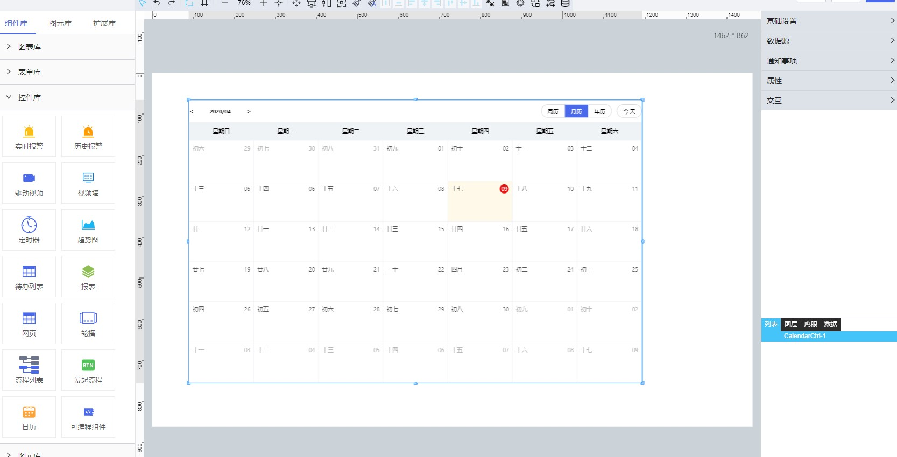

**1\.基本信息**

{.img-fluid tag=1}

#### **组件简介**

> 名称：日历
>
> 功能：按照日历形式展示数据的容器
>
> 使用场景：当数据是日期或按照日期划分时。目前支持年/月/周切换

#### **属性配置**

属性|描述信息|类型|默认值|设值方法|取值方法
--|--|--|--|--|--
位置|设置控件位置|||setPosition({x:100,y:100})|getPosition()
大小|设置控件大小|||setSize({width:100,height:100})|getSize()
数据源|通过属性/服务设置通知事项的数据||  | setDataSource(object) `注：object 过于复杂，不建议使用脚本修改数据源`|setDataSource() 
周历|设置显隐周历
月历|显示月历，不可隐藏
年历|设置显隐年历；
默认选中|设置默认选中展示的日历类型||月历
默认值|默认值的key(不可修改)|string|`init`|setInitValue(value)|getInitValue()
默认名称|显示默认通知事项类型的标题|string|默认|setInitName(value)|getInitName()
默认颜色|设置默认通知事项类型的字体颜色||`#979797`|setInitColor(value)|getInitColor()
正常值|正常值的key(不可修改)|string|`success`|setSuccessValue(value)|getSuccessValue()
正常名称|显示正常通知事项类型的标题|string|正常|setSuccessName(value)|getSuccessName()
正常颜色|设置正常通知事项类型的字体颜色||`#4a68ea`|setSuccessColor(value)|getSuccessColor()
逾期值|逾期值的key(不可修改)|string|`error`|setErrorValue(value)|getErrorValue()
逾期名称|显示逾期通知事项类型的标题|string|逾期|setErrorName(value)|getErrorName()
逾期颜色|设置逾期通知事项类型的字体颜色||`#ee1111`|setErrorColor(value)|getErrorColor()
背景颜色|设置控件整体背景||`#fff`
主体字体|设置控件整体字体类型|setContextFontFamily(value)|getContextFontFamily()
头部日期大小|设置头部日期的字体大小|number|13|setHeaderDateFontSize(value)|getHeaderDateFontSize()
头部日期颜色|设置头部日期的字体颜色|string|`#000`|setHeaderDateColor(value)|getHeaderDateColor()
按钮大小|设置头部`周历/月历/年历/今天`按钮样式|number|13|setButtonFontSize(value)|getButtonFontSize()
按钮颜色|设置头部`周历/月历/年历/今天`按钮样式|string|`#000`|setButtonColor(value)|setButtonColor()
按钮背景|设置头部`周历/月历/年历/今天`按钮样式|string|`#fff`|setButtonBackgroundColor(value)|getButtonBackgroundColor()
按钮选中颜色|设置头部`周历/月历/年历/今天`按钮样式|string|`#fff`|setButtonSelectedColor(value)|getButtonSelectedColor()
按钮选中背景|设置头部`周历/月历/年历/今天`按钮样式|string|`#4a68ea`|setButtonSelectedBackgroundColor(value)|getButtonSelectedBackgroundColor()
标题大小|设置标题字体大小|number|14|setTitleFontSize(value)|getTitleFontSize()
标题颜色|设置标题字体颜色|string|`#000`|setTitleColor(value)|getTitleColor()
标题字体|设置标题字体类型|string||setTitleFontFamily(value)|getTitleFontFamily()
标题背景|设置标题背景|string|`#eff3f6`|setTitleBackgroundColor(value)|getTitleBackgroundColor()
内容大小|设置内容字体大小|number|14|setContextFontSize(value)|getContextFontSize()
内容颜色|设置内容字体颜色|string|`#000000a6`|setContextColor(value)|getContextColor()
内容背景|设置内容背景|string|`#fff`|setContextBackgroundColor(value)|getContextBackgroundColor()
选中大小|设置选中内容字体大小|number|14|setSelectedFontSize(value)|getSelectedFontSize()
选中颜色|设置选中内容字体颜色|string|`#000000a6`|setSelectedColor(value)|getSelectedColor()
选中背景|设置选中内容背景|string|`#fff9ea`|setSelectedBackgroundColor(value)|getSelectedBackgroundColor()
当天颜色|设置当天内容字体颜色|string|`#fff`|setTodayColor(value)|getTodayColor()
当天背景|设置当天内容背景|string|`#f00`|setTodayBackgroundColor(value)|getTodayBackgroundColor()
交互|提供脚本执行选中事件|string|||输出 `date` 格式： 周历/月历：`2020-03-27` 年历：`2020-3`

#### **数据格式**

```json
{
    list:[
        {
            date:'2019-11-11',
            children:[
                { 
                    type:'init',
                    content:'此处为待办事项'
                    url:'http://www.xxx.com' // 链接 选填
                },
               { 
                    type:'success',
                    content:'此处为待办事项'
                    url:'http://www.xxx.com' // 链接 选填
                },
               { 
                    type:'error',
                    content:'此处为待办事项'
                    url:'http://www.xxx.com' // 链接 选填
                }
            ]
        },
        {
            date:'2019-11-12',
            children:[
                { 
                    type:'init',
                    content:'此处为待办事项'
                    url:'http://www.xxx.com' // 链接 选填
                },
               { 
                    type:'success',
                    content:'此处为待办事项'
                    url:'http://www.xxx.com' // 链接 选填
                },
               { 
                    type:'error',
                    content:'此处为待办事项'
                    url:'http://www.xxx.com' // 链接 选填
                }
            ]
        }
    ]
}
```

---
