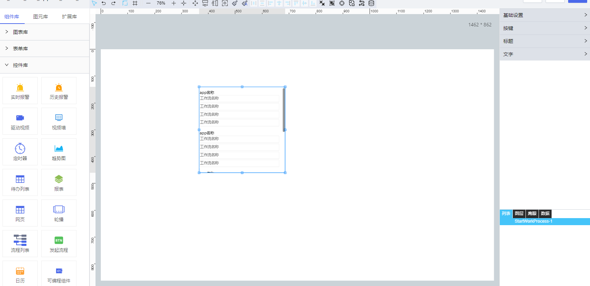

**1\. 基本信息**

{.img-fluid tag=1}

#### **组件简介**

> 名称：流程列表
>
> 功能：用于展示当前用户所具有的所有发起流程的入口权限列表
>
> 使用场景：

#### **属性配置**

| 属性    | 描述信息         | 类型   | 默认值 | 设值方法                   | 取值方法   |
| :------ | :--------------- | :----- | ------ | -------------------------- | ---------- |
位置|设置控件位置|||setPosition({x:100,y:100})|getPosition()
大小|设置控件大小|||setSize({width:100,height:100})|getSize()
| 列数 |    设置展示列数|number|1|setColsNum(value)|getColsNum()
| 按键外边距 |设置按键相关样式||{left: 0, top: 0, right: 12, bottom: 4}|setButtonMargin(value)|getButtonMargin()
| 按键内边距 |设置按键相关样式||{left: 0, top: 0, right: 12, bottom: 4}|setButtonPadding(value)|getButtonPadding()
| 按键填充 |设置按键相关样式|[按钮填充格式](#按钮填充格式)|{backgroundType: "pure", background: "#fff", gradient: undefined, isLoading: false, gradientColor: undefined}|setButtonBackground(value)|getButtonBackground()
| 按键边框 |设置按键相关样式||{color: "#eee", width: 1, borderStyle: "solid", endStyle: undefined, isLoading: false}|setButtonBorder(value)|getButtonBorder()
| 标题字体 |    设置标题的相关样式||{fontFamily: "微软雅黑", fontSize: 14, fontWeight: "normal", fontStyle: "normal", textAlign: "left"}|setTitleFont(value)|getTitleFont()
| 标题颜色 |    设置标题的相关样式|string|`#000`|setTitleColor(value)|getTitleColor()
| 标题上边距 |    设置标题的相关样式|number|8|setTitleMarginTop(value)|getTitleMarginTop()
| 文字字体 |    设置文字的相关样式||{fontFamily: "微软雅黑", fontSize: 14, fontWeight: "normal", fontStyle: "normal", textAlign: "left"}|setContentFont(value)|getContentFont()
| 文字颜色 |    设置文字的相关样式|string|`#666`|setContentColor(value)|setContentColor()

#### **<a id="按钮填充格式">按钮填充格式</a>**

```json
{
    backgroundType, // 填充类型 pure 纯色 gradient 渐变色
    background, // 背景色
    gradient, // 渐变类型
    gradientColor // 渐变颜色
}
```

---
