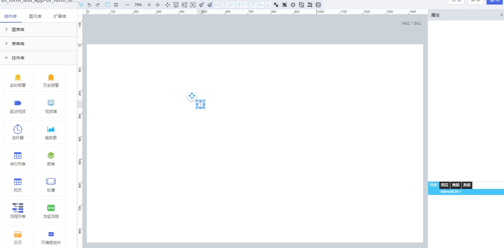

**1\. 基本信息**

{.img-fluid tag=1}

#### **组件简介**

> 名称：定时器
>
> 功能：用于定时执行脚本方法
>
> 使用场景：

#### **属性配置**

| 属性    | 描述信息         | 类型   | 默认值 | 设值方法                   | 取值方法   |
| :------ | :--------------- | :----- | ------ | -------------------------- | ---------- |
| 组件 ID | 控件 ID 自动生成 | string |        |                            |            |
| 组件名称    | 控件的赋值标识符       | string |        | setFormItemId(value) | getFormItemId() |
| 时间间隔    | 执行定时器的时间间隔（秒）       | number |    1    |  setSecond(value)| getSecond() |
| 立即执行    | 控件加载完成后立即执行设置的脚本       | boolean |   false     | setStartNow(value) | getStartNow() |
| 执行次数    | 定时器循环执行的次数，勾选立即执行，会占用一次执行次数       | number |    不限制    | setTimesRun(value) | getTimesRun() |
| 执行脚本    | 定时器执行的脚本，可选项 `刷新` `自定义`       | [脚本数据格式](#脚本数据格式) |        | setIntervalScript(value) | getIntervalScript() |

#### **示例代码**

##### **<a id="脚本数据格式">脚本数据格式</a>**

```json
{
    type, //脚本类型 reload 刷新 custom 自定义
    script //脚本内容
}
```

##### **清除定时器**

```javascript
// htDiv72：控件id
var Interval = scriptUtil.getRegisterReactDom('htDiv72');
Interval.clearTimer();
```

##### **启动定时器**

清除运行的定时器后，可通过脚本重新启动定时器

```javascript
// htDiv72：控件id
var Interval = scriptUtil.getRegisterReactDom('htDiv72');
Interval.startTimer();
```

---
