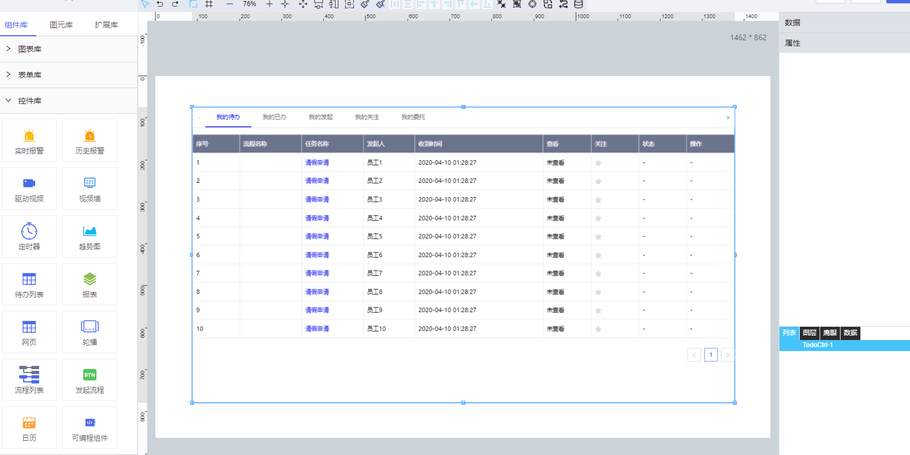

**1\. 基本信息**

{.img-fluid tag=1}

#### **组件简介**

> 名称：待办列表
>
> 功能：展示待办、已办等工作流数据
>
> 使用场景：用于工作流发起的流程查询

#### **属性配置**

| 属性    | 描述信息         | 类型   | 默认值 | 设值方法                   | 取值方法   |
| :------ | :--------------- | :----- | ------ | -------------------------- | ---------- |
| 数据 | 展示我的待办、我的已办、我的发起等标签以及流程名称、任务名称等工作流数据 | | [数据格式](#数据格式)|setTabs(value)|getTabs()           
| 每页条数    | 设置每页显示记录条数       | number | 10  |setPageSize(value)|getPageSize()
| 边框    | 有无边框       | string 'true' 'false' | 有   |setBorder(value)|getBorder()   
| 边框大小    | 边框大小       | number |       1|setBorderWidth(value)|getBorderWidth()
| 边框类型    | 边框类型  `实线` `点线` `虚线`     | string |  实线|setBorderStyle(value)|getBorderStyle()
| 边框颜色    | 边框颜色       | string | `#e8e8e8`|setBorderColor(value)|getBorderColor()
| 列宽自适应    | 列宽根据内容自适应       | boolean |  true |setAutoWidth(value)|getAutoWidth()    
| 表头背景    | 表头背景       | string |   `#6c748d`|  setTheadBackgroundColor(value)|getTheadBackgroundColor() 
| 字体颜色    | 表头字体颜色       | string |      `#fff`|setTheadFontColor(value)|getTheadFontColor()
| 字体大小    | 表头字体大小       | number |      14|setTheadFontSize(value)|getTheadFontSize()
| 字体    | 表头字体类型       | string |      微软雅黑|setTheadFontFamily(value)|getTheadFontFamily()
| 表身背景    | 表身背景       | string |   `#fff` |  setTbodyBackgroundColor(value)|getTbodyBackgroundColor()
| 字体颜色    | 表身字体颜色       | string | `#000`|setTbodyFontColor(value)|getTbodyFontColor()
| 字体大小    | 表身字体大小       | number |      14|setTbodyFontSize(value)|getTbodyFontSize()
| 字体    | 表身字体类型       | string |      微软雅黑|setTbodyFontFamily(value)|getTbodyFontFamily()
| 单行颜色    | 单行颜色       |string  |      `#fff`|setSingleRowColor(value)|getSingleRowColor()
| 双行颜色    | 双行颜色       | string |      `#fff`|setDoubleRowColor(value)|setDoubleRowColor()

#### **<a id="数据格式">数据格式</a>**

```json
[
    {
        value: 'todo', // todo 我的待办 done 我的已办 request 我的发起 attention 我的关注 delegate 我的委托
        label: '我的待办',
        isShow: true, // 是否展示该标签
        children: [ // 表格内容
            { 
                label: '序号', 
                value: 'index', 
                isShow: true, // 是否展示该条目
                showModal: false, // 点击显示弹框
                url: '', // 弹框链接
                modalWidth: 1200, // 弹框宽度
                modalHeight: 800, // 弹框高度
                style: { 
                    color: '#000', // 条目样式
                    fontSize: 14,
                    fontFamily: '微软雅黑'
                }
            },
            ...
        ]
    },
    ...
]
```

---
