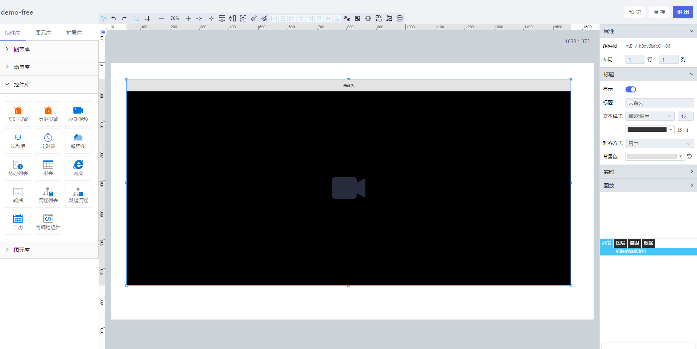

**1\. 基本信息**

{.img-fluid tag=1}

#### **组件简介**

> 名称：视频墙
>
> 功能：多个视频同时播放
>
> 使用场景： 视频监控页面，现场大屏

#### **属性配置**

| 属性     | 描述信息         | 类型   | 默认值         | 设值方法                  | 取值方法             |
| :------- | :--------------- | :----- | -------------- | ------------------------- | -------------------- |
| 布局     | 显示几行几列视频 | Object | {row: 1,col:1} | setLayout(Object)         | getLayout()          |
| 显示标题 | 是否显示标题     | Boole  | true           | setTitleVisibility(Boole) | getTitleVisibility() |
| 标题     | 标题文本         | String |                | setTitle(String)          | getTitle()           |
| 文本样式 | 标题样式         | Object |                | setChartTitle(Object)     | getChartTitle()      |
| 对齐方式 | 标题对齐方式     | String | 'center'       | setTitleAlign(String)     | getTitleAlign()      |
| 背景色   | 标题栏背景色     | String | '#e3e3e3'      | setBgColor(String)        | getBgColor()         |
| 自动播放 | 是否自动播放视频 | Boole  | true           | setAutoPlay(boole)        | getAutoPlay()        |
| 视频轮播 | 是否轮流播放视频 | Object |                | setStreamSource(Object)   | getStreamSource()    |
| 实时播放 | 实时视频数据     | Object |                | setHistorySource(Object)  | getHistorySource()   |

#### **示例代码**

```javascript
// **设置标题样式**
scriptUtil.getRegisterReactDom("控件id").setChartTitle({
  fontSize: 12, // 字体大小
  fontFamily: "微软雅黑", // 字体
  color: "#333333", // 字体颜色
  fontWeight: "", // 字体粗细
  fontStyle: "", // 字体风格
});
```

```javascript
// 设置视频轮播数据
scriptUtil.getRegisterReactDom("控件id").setStreamSource({
  carousel: false, // 是否轮播
  maxchannel: null, // 最多频道
  chooseChannel: undefined, // 选择频道
  cameramodel: null, // 视频模式
  manufacturer: null, // 制造商
  videoSource: "", // 视频源数据
});
// 设置实时回放数据
scriptUtil.getRegisterReactDom("控件id").setHistorySource({
  videoSource: "", // 视频源数据
});
```
