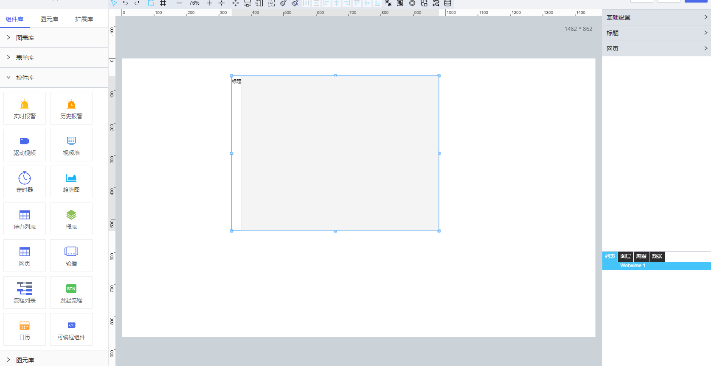

**1\. 基本信息**

{.img-fluid tag=1}

#### **组件简介**

> 名称：网页
>
> 功能：嵌套展示页面
>
> 使用场景：

#### **属性配置**

| 属性    | 描述信息         | 类型   | 默认值 | 设值方法                   | 取值方法   |
| :------ | :--------------- | :----- | ------ | -------------------------- | ---------- |
| 组件 ID | 控件 ID 自动生成 | string |        |                            |            |
| 组件名称    | 控件的赋值标识符       | string |        | setFormItemId(value) | getFormItemId() |
标题内容|标题内容|string|标题|setLabelContent(value)|getLabelContent()
标题字体|标题字体||{fontFamily: "微软雅黑", fontSize: 14, fontWeight: "normal", fontStyle: "normal", textAlign: "left"}|setTitleFont(value)|getTitleFont()
标题内容|标题内容|string|`#000`|setTitleColor(value)|getTitleColor()
标题边距|标题边距||{left: 0, top: 0, right: 0, bottom: 0}|setTitleMargin(value)|getTitleMargin()
网址|网址|string||setUrl(value)|getUrl()
去iframe|是否去iframe|boolean|false|setIsNoIframeMode(value)|getIsNoIframeMode()
网页外边距|网页外边距||{left: 0, top: 0, right: 0, bottom: 0}|setIframeMargin(value)|getIframeMargin()
网页内边距|网页内边距||{left: 0, top: 0, right: 0, bottom: 0}|setIframePadding(value)|getIframePadding()
网页背景|网页背景|string|`#f5f4f4`|setBackColor(value)|getBackColor()
网页边框|网页边框||{color: "#dedede", width: 1, borderStyle: "solid"}|setIframeBorder(value)|getIframeBorder()
数据源|通过属性/服务设置通知事项的数据||  | setObject(object) `注：object 过于复杂，不建议使用脚本修改数据源`|getObject() 


#### **数据格式**

```json
{
  url: ''
}
```

---