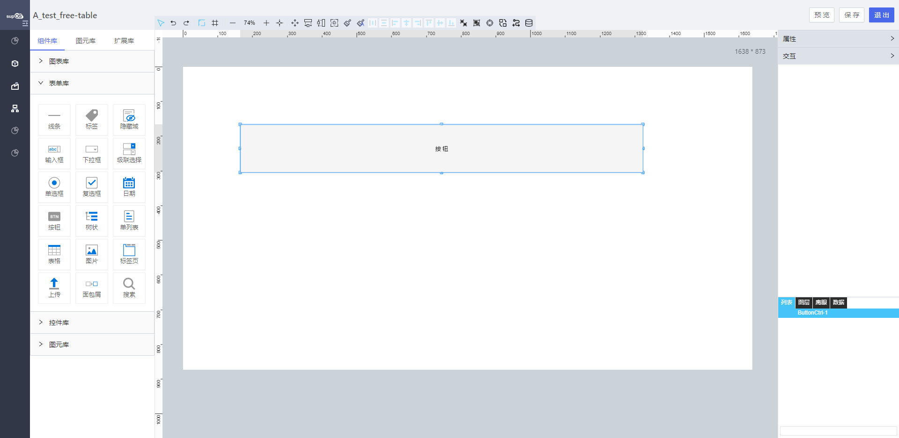

<h2>按钮</h2>

---

**1\. 基本信息**

{.img-fluid tag=1}

#### **组件简介**

> 名称：按钮
>
> 功能：按钮触发事件
>
> 使用场景：搜索/ 添加 / 编辑等情况

#### **属性配置**

| 属性       | 描述信息                                         | 类型                          | 默认值        | 设值方法                     | 取值方法               |
| ---------- | ------------------------------------------------ | ----------------------------- | ------------- | ---------------------------- | ---------------------- |
| 组件ID     | 控件ID，该组件的唯一标识， 自动生成              | string                        |               |                              |                        |
| 组件名称   | 控件的赋值标识符，在表单中， 代表数据存储的key值 | string                        |               | setFormItemId\(string\)      | getFormItemId\(\)      |
| 按钮标题   | 按钮的文字                                       | string                        | 按钮          | setButtonName\(\)            | getButtonName\(\)      |
| 标题颜色   | 按钮标题的颜色                                   | string                        | \#000000      | setTitleColor\(\)            | getTitleColor\(\)      |
| 标题字体   | 标题的字体                                       | string                        | 微软雅黑      | setTitleFontFamily\(\)       | getTitleFontFamily\(\) |
| 加粗       | 标题是否加粗                                     | 'normal' /  'bold'            | 普通          | setFontWeight\(\)            | getFontWeight\(\)      |
| 标题大小   | 标题字体大小                                     | number                        | 16            | setTitleFontSize\(number\)   | getTitleFontSize\(\)   |
| 边框宽度   | 默认边框大小为1，可自定义                        | number                        | 边框大小为1   | setBorderWidth\(number\)     | getBorderWidth\(\)     |
| 边框颜色   | 边框颜色可自定义配置                             | string                        | \#F5F5F5      | setBorderColor\(string\)     | getBorderColor\(\)     |
| 边框类型   | 默认为实线，边框类型：实线、点线、虚线           | 'solid' / 'dotted' / 'dashed' | 实线: 'solid' | setBorderStyle\(string\)     | getBorderStyle         |
| 圆角半径   | 按钮的圆角                                       | number                        | 2             | setBorderRadius\(number\)    | getBorderRadius\(\)    |
| 按钮图标   | 按钮的图标                                       | string                        | 无            | setIcon\(string\)            | getIcon\(\)            |
| 自定义图标 | 可以自定义按钮的图标                             | string                        | 无            | setIconUpload\(string\)      | getIconUpload\(\)      |
| 图标位置   | 自定义图标的显示位置                             | string                        | 居左          | setIconPos\(string\)         | getIconPos\(\)         |
| 图标大小   | 自定义图标的大小                                 | string                        | 默认          | setIconSize\(string\)        | getIconSize\(\)        |
| 背景色     | 按钮的背景颜色                                   | string                        | \#F5F5F5      | setBackgroundColor\(string\) | getBackgroundColor\(\) |
| 打印隐藏   | 打印的时候是否隐藏                               | boolean                       | false         | setPrintHidden\(boolean\)    | getPrintHidden\(\)     |
| 是否可用   | 是否点击无效，不可用                             | boolean                       | false         | setDisabled\(boolean\)       | getDisabled\(\)        |

#### **公共属性配置**： [定位层级/组件宽高设置/定位](../../../CommonIntro/freeDesignerFormCommon.md)

#### **公共交互配置**： [交互配置](../../../CommonIntro/action.md)