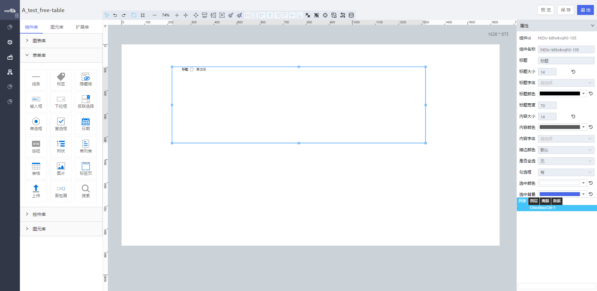

<h2>复选框</h2>

---

**1\. 基本信息**

{.img-fluid tag=1}

#### **组件简介**

> 名称：复选框
>
> 功能：用于选项多选
>
> 使用场景：

#### **属性配置**

| 属性     | 描述信息                                                 | 类型                                               | 默认值                | 设值方法                                 | 取值方式                             |
| -------- | -------------------------------------------------------- | -------------------------------------------------- | --------------------- | ---------------------------------------- | ------------------------------------ |
| 组件id   | 该控件唯一标识，                                         |                                                    |                       |                                          |                                      |
| 组件名称 | 组件名称                                                 | string                                             |                       | setFormItemId\(\)                        | getFormItemId\(\)                    |
| 内容大小 | 组件内容的字体大下                                       | number                                             | 14                    | setContextFontSize\(\)                   | getContextFontSize\(\)               |
| 内容字体 | 组件内容的字体类型                                       | string                                             |                       | setContextFontFamily\(string             | getContextFontFamily\(\)             |
| 字体颜色 | 该字体的颜色 默认 \#000000                               | string                                             | 'rgba\(0,0,0,0\.65\)' | setTextCheckedColor\(string\)            | getTextCheckedColor\(\)              |
| 描边颜色 | 默认  紫 蓝 黄 绿 红                                     | '' / 'purple' / 'blue'/ 'yellow' / 'green' / 'red' | ''                    | setCheckedBackground\(string\)           | getCheckedBackground\(\)             |
| 是否全选 | 无                                                       | 'no' / 'yes'                                       | no                    | setHasAllChecked\(string\)               | getHasAllChecked\(\)                 |
| 勾选框   | 有                                                       | 'no' / 'yes'                                       | no                    | setHasIcon\(string\)                     | getHasIcon\(\)                       |
| 选中颜色 | 选中选项后按钮的字体颜色                                 | string                                             |                       | setLabelCheckedColor\(string\)           | getLabelCheckedColor\(\)             |
| 选中背景 | 选中选项后按钮的背景色                                   | string                                             |                       | setLabelCheckedBackgroundColor\(string\) | getLabelCheckedBackgroundColor\(\)   |
| 校验时机 | 运行期是否对控件输入框内进行校验或者选择什么时机进行检验 | object                                             |                       | setValidityCheck\(object\)               | getValidityCheck\(\)                 |
| 是否必填 | 运行期控件输入框内内容是否必填                           | string                                             |                       | setValidityCheck\(object\)               | getValidityCheck\(\)\.isRequired     |
| 备选类型 | 下拉选项类型                                             | object                                             |                       | setDataSource\(object\)                  | getDataSource\(\)\.type              |
| 动态数据 | 通过对象选择器绑定动态数据渲染下拉选项                   | object                                             |                       | setDataSource\(object\)                  | getDataSource\(\)\.staticDataSource  |
| 静态数据 | 手动添加数据渲染下拉选项                                 | object                                             |                       | setDataSource\(object\)                  | getDataSource\(\)\.dynamicDataSource |
| 联动对象 | 配置其他控件对该控件的联动                               |                                                    |                       |                                          |                                      |
| 时间格式 | 配置联动的时候入参为minData/maxData格式转换              | boolean                                            | false                 | setInitFormat(boolean)                   | getInitFormat()                      |

#### **公共联动配置**： [联动](../../../CommonIntro/link.md)

#### **公共属性配置**： [标题/定位层级/组件宽高设置/定位](../../../CommonIntro/freeDesignerFormCommon.md)

#### **公共交互配置**： [交互配置](../../../CommonIntro/action.md)

#### **示例代码**

##### Checkbox复选框控件

checkbox复选框选项配置方式有三种

- 动态绑定对象的属性/动态绑定对象的服务
- 绑定静态数据源
- 通过脚本设置


##### checkbox渲染数据的格式要求
```javascript
 {
    list: [
        {
            optionText: '男',  // 显示字段
            optionValue: '1'  // 数据传输字段
        },
        {
            optionText: '女', 
            optionValue: '2'
        }
    ]
}

```

##### 获取控件虚拟DOM
```javascript

  var checkBox = instance; // window.supQuery.getInstanceById('htDiv72');

```

##### 脚本获取选中的值
```javascript

  instance.getValue();

```
##### 脚本设置选中的值
```javascript

  Checkbox.setValue(['1']);

```

