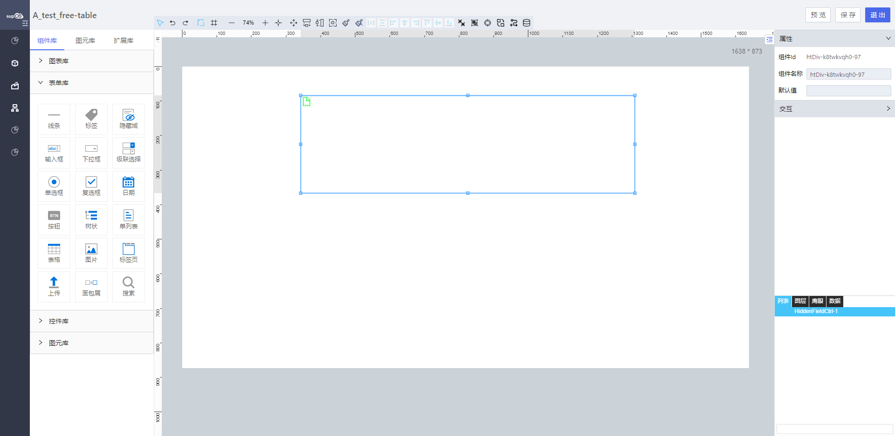

<h2>隐藏域</h2>

---

**1\. 基本信息**

{.img-fluid tag=1}

#### **组件简介**

> 名称：隐藏域
>
> 功能：用于不显示的数据，数据传递
>
> 使用场景：页面不需要显示但是有用的数据可使用

#### **属性配置**

| 属性     | 描述信息         | 类型   | 默认值 | 设值方法            | 取值方法            |
| -------- | ---------------- | ------ | ------ | ------------------- | ------------------- |
| 组件Id   | 组件Id           | string | \-     |                     |                     |
| 组件名称 | 控件的赋值标识符 | string | \-     | setFormItemId\(\)   | getFormItemId\(\)   |
| 默认值   | 设置隐藏域默认值 | string | ‘’     | setDefaultValue\(\) | getDefaultValue\(\) |

#### **公共交互配置**： [交互配置](../../../CommonIntro/action.md)

#### **示例代码**

##### 获取控件默认值
```javascript
  instance.getDefaultValue();
```

##### 设置控件值
```javascript
 var Hidden = instance;
// 字符串
Hidden.setValue("1");
// 布尔类型
Hidden.setValue(true);
// 对象
Hidden.setValue({name: 1});
```