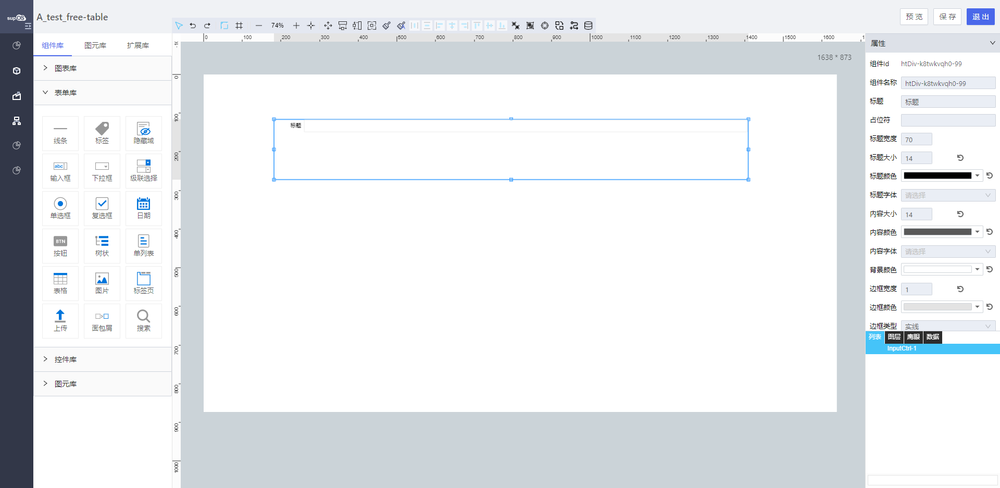

<h2>输入框</h2>

---

**1\. 基本信息**

{.img-fluid tag=1}

#### **组件简介**

> 名称：输入框
>
> 功能：用于用户输入
>
> 使用场景：

#### **属性配置**

| 属性     | 描述信息                                                                                                  | 类型                          | 默认值   | 设值方法                       | 取值方法                         |
| -------- | --------------------------------------------------------------------------------------------------------- | ----------------------------- | -------- | ------------------------------ | -------------------------------- |
| 组件id   | 该控件唯一标识，                                                                                          |                               |          |                                |                                  |
| 组件名称 | 控件命名                                                                                                  | string                        |          | setFormItemId\(string\)        | getFormItemId\(\)                |
| 占位符   | 输入框中的占位符提示                                                                                      | string                        | ''       | setPlaceHolder\(string\)       | getPlaceHolder\(\)               |
| 内容大小 | 内容的字体大小                                                                                            | number                        | 14       | setContextFontSize\(number\)   | getContextFontSize\(number\)     |
| 内容颜色 | 内容颜色                                                                                                  | string                        | \#000000 | setContextColor\(string\)      | getContextColor\(\)              |
| 内容字体 | 内容字体设置                                                                                              | string                        | ''       | setContextFontFamily\(string\) | getContextFontFamily\(\)         |
| 校验时机 | 运行期是否对控件输入框内进行校验或者选择什么时机进行检验：不检验/内容改变/失去焦点                        | Object                        |          | setValidityCheck\(object\)     | getValidityCheck\(\)             |
| 是否必填 | 运行期控件输入框内内容是否必填                                                                            | ’true‘ / ’false‘              | 'false'  | setValidityCheck\(object\)     | getValidityCheck\(\)\.isRequired |
| 格式     | 格式: 'none' / 'mobilePhone' / 'telephone' /'zipCode' / 'idCard' / 'number' / 'email' /  'ip' /  'custom' | string                        | ‘none’   | setValidityCheck\(object\)     | getValidityCheck\(\)\.customReg  |
| 是否多行 | 输入框是否支持多行                                                                                        | ’no‘ / ’yes‘                  | ’no‘     | setIsMultipleLine\(string\)    | getIsMultipleLine\(\)            |
| 边框宽度 | 搜索框边框宽度                                                                                            | number                        | 1        | setBorderWidth\(number\)       | getBorderWidth\(\)               |
| 边框颜色 | 搜索框边框颜色                                                                                            | string                        | \#fff    | setBorderColor\(string\)       | getBorderColor\(\)               |
| 边框类型 | 搜索框边框类型                                                                                            | ‘solid’ / 'dotted' / 'dashed' | ‘solid’  | setBorderStyle\(string\)       | getBorderStyle\(\)               |
| 背景颜色 | 搜索框背景颜色                                                                                            | string                        | \#fff    | setBackgroundColor\(\)         | getBackgroundColor\(\)           |
| 最大长度 | 输入框内可输入的文本最大长度                                                                              | number                        | 500      | setMaxLength\(number\)         | getMaxLength\(\)                 |


#### **公共属性配置**： [标题/定位层级/组件宽高设置/定位（上下左右固定）](../../../CommonIntro/freeDesignerFormCommon.md)

#### **公共交互配置**： [交互配置](../../../CommonIntro/action.md)

#### **示例代码**

##### 获取控件虚拟DOM：
```javascript
var inputCtrl = instance; // 或者 window.supQuery.getInstanceById('XXX')

```

##### 获取控件值：
```javascript
instance.getValue();

```

##### 设置控件值：
```javascript
instance.setValue('XXXX');

```
