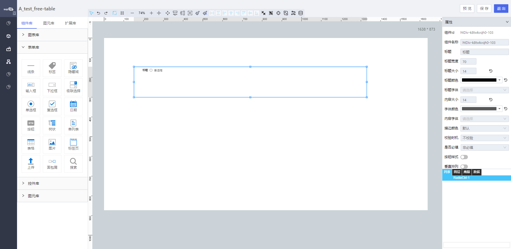

<h2>单选框</h2>

---

**1\. 基本信息**

{.img-fluid tag=1}

#### **组件简介**

> 名称：单选框
>
> 功能：用于用户单选使用
>
> 使用场景：

#### **属性配置**

| 属性     | 描述信息                                                 | 类型                          | 默认值   | 设值方法                            | 取值方法                             |
| -------- | -------------------------------------------------------- | ----------------------------- | -------- | ----------------------------------- | ------------------------------------ |
| 组件id   | 该控件唯一标识，                                         |                               |          |                                     |                                      |
| 组件名称 | 组件名称                                                 | string                        |          | setFormItemId\(string\)             | getFormItemId\(\)                    |
| 内容大小 | 文本字体大小                                             | number                        | 14       | setContextFontSize\(string\)        | getContextFontSize\(\)               |
| 字体颜色 | 该字体的颜色 默认 \#000000                               | string                        |          | setTextCheckedColor\(string\)       | getTextCheckedColor\(\)              |
| 描边颜色 | 默认                                                     | string                        |          | setCheckedBackground\(string\)      | getCheckedBackground\(\)             |
| 按钮间距 | 按钮样式的时候 中间的间距                                | number                        |          | setButtonMargin\(number\)           | getButtonMargin\(\)                  |
| 边框大小 | 按钮边框的大小                                           | number                        |          | setButtonBorderWidth\(number\)      | getButtonBorderWidth\(\)             |
| 边框颜色 | 按钮边框的颜色                                           | string                        |          | setButtonBorderColor\(string\)      | getButtonBorderColor\(\)             |
| 边框类型 | 边框类型的                                               | 'solid' / 'dotted' / 'dashed' | 'solid'  | setButtonBorderStyle\(\)            | getButtonBorderStyle\(\)             |
| 校验时机 | 运行期是否对控件输入框内进行校验或者选择什么时机进行检验 | object                        |          | setValidityCheck\(object\)          | getValidityCheck\(\)                 |
| 是否必填 | 运行期控件输入框内内容是否必填                           | ’true‘ / ’false‘              | ’false‘  | setValidityCheck\(object\)          | getValidityCheck\(\)\.isRequired     |
| 按钮样式 | 设置选项为按钮样式                                       | boolean                       | false    | setButtonType\(\)                   | getButtonType\(\)                    |
| 垂直排列 | 垂直排列                                                 | boolean                       | false    | setCutLine\(\)                      | getCutLine\(\)                       |
| 按钮背景 | 按钮背景颜色                                             | string                        | \#fff    | setButtonBackground\(string\)       | getButtonBackground\(\)              |
| 选中背景 | 选中选项后按钮的背景色                                   | string                        | \#5E71E9 | setButtonSelectBackground\(string\) | getButtonSelectBackground\(\)        |
| 选中颜色 | 选中选项后按钮的字体颜色                                 | string                        | \#fff    | setButtonSelectColor\(string\)      | getButtonSelectColor\(\)             |
| 备选类型 | 下拉选项类型                                             | object                        |          | setDataSource\(object\)             | getDataSource\(\)\.type              |
| 动态数据 | 通过对象选择器绑定动态数据渲染下拉选项                   | object                        |          | setDataSource\(object\)             | getDataSource\(\)\.staticDataSource  |
| 静态数据 | 手动添加数据渲染下拉选项                                 | object                        |          | setDataSource\(object\)             | getDataSource\(\)\.dynamicDataSource |
| 联动对象 | 配置其他控件对该控件的联动                               |                               |          |                                     |                                      |
| 时间格式 | 配置联动的时候入参为minData/maxData格式转换              | boolean                       | false    | setInitFormat(boolean)              | getInitFormat()                      |

#### **公共联动配置**： [联动](../../../CommonIntro/link.md)

#### **公共属性配置**： [标题/定位层级/组件宽高设置/定位](../../../CommonIntro/freeDesignerFormCommon.md)

#### **公共交互配置**： [交互配置](../../../CommonIntro/action.md)

#### **示例代码**

# Radio单选框控件

radio单选框选项配置方式有三种

- 动态绑定对象的属性
- 绑定静态数据源
- 通过脚本设置

##### 获取控件虚拟DOM：

```javascript
 var Checkbox = instance；
 // 或者
 var Checkbox = window.supQuery.getInstanceById('XXX');

```

##### 获取选中的值：
```javascript
  instance.getValue();
```

##### 设置选中的值：
```javascript
  instance.setValue('XX');
```