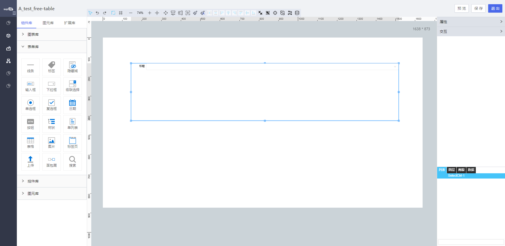

<h2>下拉框</h2>

---

**1\. 基本信息**

{.img-fluid tag=1}

#### **组件简介**

> 名称：下拉框
>
> 功能：用于下拉选择的数据
>
> 使用场景：用于下拉选择的场景

#### **属性配置**

| 属性     | 描述信息                                                 | 类型                          | 默认值                   | 设值方法                       | 取值方法                             |
| -------- | -------------------------------------------------------- | ----------------------------- | ------------------------ | ------------------------------ | ------------------------------------ |
| 组件id   | 该控件唯一标识，                                         |                               |                          |                                |                                      |
| 组件名称 | 控件命名                                                 | string                        |                          | setFormItemId\(string\)        | getFormItemId\(\)                    |
| 占位符   | 下拉框的占位符                                           | string                        |                          | setPlaceholder\(string\)       | getPlaceholder\(\)                   |
| 内容大小 | 下拉框框内内容的大小                                     | number                        | 14                       | setContextFontSize\(number\)   | getContextFontSize\(\)               |
| 内容颜色 | 下拉框框内内容的颜色                                     | string                        | 'rgba\(0, 0, 0, 0\.65\)' | setContextColor\(string\)      | getContextColor\(\)                  |
| 内容字体 | 下拉框框内内容的字体                                     | string                        |                          | setContextFontFamily\(string\) | getContextFontFamily\(\)             |
| 背景颜色 | 下拉框框内内容的背景颜色                                 | string                        | \#fff                    | setBackgroundColor\(string\)   | getBackgroundColor\(\)               |
| 边框宽度 | 下拉框边框的宽度                                         | number                        | 1                        | setBorderWidth\(string\)       | getBorderWidth\(\)                   |
| 边框颜色 | 下拉框边框的颜色                                         | string                        | \#E3E3E3                 | setBorderColor\(string\)       | getBorderColor\(\)                   |
| 边框类型 | 下拉框边框的类型                                         | ‘solid’ / ‘dotted’ / ‘dashed’ |                          | setBorderStyle\(string\)       | getBorderStyle\(\)                   |
| 校验时机 | 运行期是否对控件输入框内进行校验或者选择什么时机进行检验 | object                        |                          | setValidityCheck\(Object\)     | getValidityCheck\(\)                 |
| 是否必填 | 运行期控件输入框内内容是否必填                           | ’true‘ / 'false'              | 'false'                  | setValidityCheck\(Object\)     | getValidityCheck\(\)\.isRequired     |
| 备选类型 | 下拉选项类型                                             | object                        | 动态                     | setdataSource\(Object\)        | getdataSource\(\)\.type              |
| 动态数据 | 通过对象选择器绑定动态数据渲染下拉选项                   | object                        | \-                       | setdataSource\(Object\)        | getdataSource\(\)\.dynamicDataSource |
| 静态数据 | 手动添加数据渲染下拉选项                                 | object                        | \-                       | setdataSource\(Object\)        | getdataSource\(\)\.staticDataSource  |
| 排序     | 下拉框数据进行排序                                       | ’ordinary‘ / ’up‘ / ’down‘    | 'ordinary'               | setListOrder\(string\)         | getListOrder\(\)                     |
| 是否多选 | 配制下拉框是否支持多选                                   | boolean                       | true / false             | setIsMultiple\(boolean\)       | getIsMultiple\(\)                    |


#### **公共属性配置**： [标题/定位层级/组件宽高设置/定位](../../../CommonIntro/freeDesignerFormCommon.md)

#### **公共交互配置**： [交互配置](../../../CommonIntro/action.md)

#### **示例代码**

##### Select 下拉框控件

Select 选项配置方式有三种

- 动态绑定对象的属性
- 绑定静态数据源
- 通过脚本设置

##### 获取控件虚拟 DOM：

```javascript
  var selectCtrl = instance; // 或者 window.supQuery.getInstanceById('XXX');

```

##### 获取选中的值：

```javascript
  instance.getValue();

```

##### 设置选中的值:

```javascript
  instance.setValue('1');

```

##### 导入 select 选项:

```javascript
 var data = [
      {
        optionText: '男', 
        optionValue: '1'
      },
      {
        optionText: '女',
        optionValue: '2'
      }
  ];
  instance.setObjectData(data);

```

##### 脚本设置 select 是否多选:

```javascript

  instance.setIsMultiple(true);

```