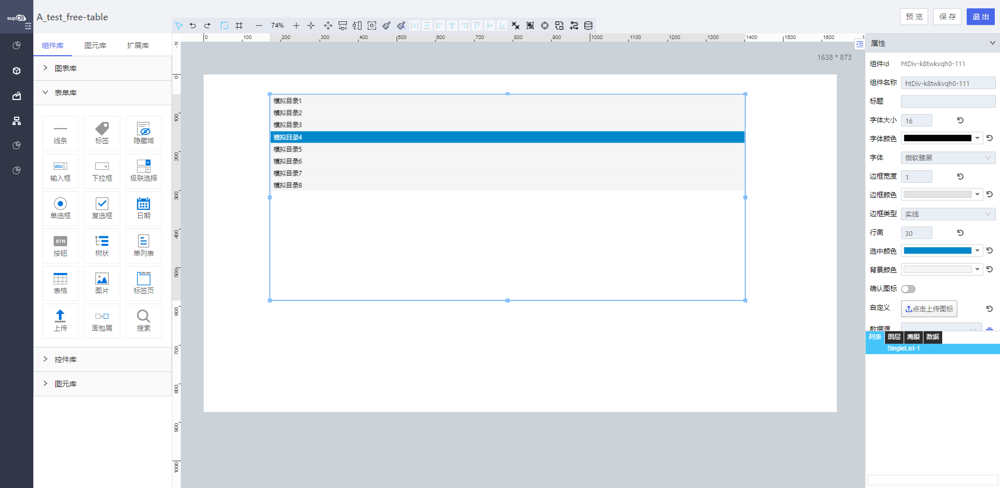

<h2>单列表</h2>

---

**1\. 基本信息**

{.img-fluid tag=1}

#### **组件简介**

> 名称：单列表
>
> 功能：用于用户输入
>
> 使用场景：

#### **属性配置**

| 属性     | 描述信息                                         | 类型                          | 默认值        | 设值方法                           | 取值方式                          |
| -------- | ------------------------------------------------ | ----------------------------- | ------------- | ---------------------------------- | --------------------------------- |
| 组件ID   | 控件ID，该组件的唯一标识， 自动生成              | string                        |               |                                    |                                   |
| 组件名称 | 控件的赋值标识符，在表单中， 代表数据存储的key值 | string                        | 同组件ID      | setFormItemId\(string\)            | getFormItemId\(\)                 |
| 标题     | 标题文字                                         | string                        |               | setTitle\(string\)                 | getTitle\(\)                      |
| 字体大小 | 字体的大小                                       | string                        | 16            | setFontSize\(number\)              | getFontSize\(\)                   |
| 文字颜色 | 文字 的颜色                                      | string                        | \#000000      | setFontColor\(string\)             | getFontColor\(\)                  |
| 边框宽度 | 默认边框大小为1，可自定义                        | number                        | 边框大小为1   | setBorderWidth\(string\)           | getBorderWidth\(\)                |
| 边框类型 | 默认为实线，边框类型：实线、点线、虚线           | 'solid' / 'dotted' / 'dashed' | 实线: 'solid' | setBorderColor\(string\)           | getBorderColor\(\)                |
| 边框颜色 | 边框颜色可自定义配置                             | string                        | \#E3E3E3      | setBorderColor\(string\)           | getBorderColor\(\)                |
| 行高     | 行高                                             | number                        | 30            | setLineHeightStyle\(number\)       | getLineHeightStyle\(\)            |
| 选中颜色 | 选中状态的颜色                                   | string                        | \#0088CC      | setSelectBackgroundColor\(string\) | getSelectBackgroundColor\(\)      |
| 背景颜色 | 背景颜色                                         | string                        | \#f5f5f5      | setBackgroundColor\(string\)       | getBackgroundColor\(\)            |
| 确认图标 | 确认图标                                         | boolean                       | false         | setIsShowIcon\(\)                  | getIsShowIcon\(\)                 |
| 自定义   | 可以自定义按钮的图标                             | string                        | 无            | setIconUpload\(\)                  | getIconUpload\(\)                 |
| 数据源   | 动态数据的数据源                                 | object                        |               | setObjectLabel\(object\)           | getsetObjectLabel\(\)\.dataSource |
| 联动对象 | 配置其他控件对该控件的联动                       |                               |               |                                    |                                   |
| 时间格式 | 配置联动的时候入参为minData/maxData格式转换      | boolean                       | false         | setInitFormat(boolean)             | getInitFormat()                   |

#### **公共联动配置**： [联动](../../../CommonIntro/link.md)

#### **公共属性配置**： [定位层级/组件宽高设置/定位](../../../CommonIntro/freeDesignerFormCommon.md)

#### **公共交互配置**： [交互配置](../../../CommonIntro/action.md)

#### **示例代码**

##### 获取单列表
```javascript
  var singleList = instance; // 或者 window.supQuery.getInstanceById('XXX')

```

##### 动态绑定数据源数据格式

```javascript
   var data = {
    list: [
      {
       	label: 'name',
        value: 'showName'
      },
     {
       	label: 'name1',
        value: 'showName1'
      }
    ]
  }

```

##### 设置选中

```javascript
  instance.setValue('XXXX');

```