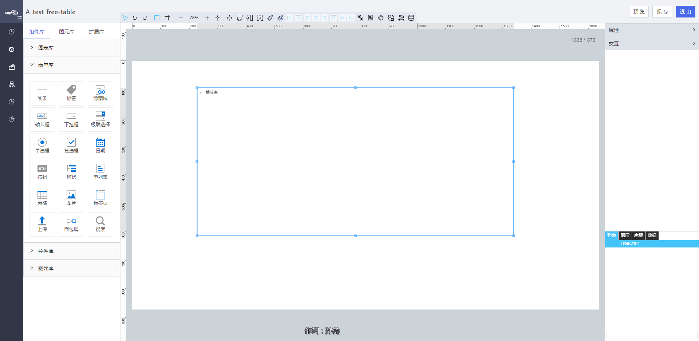

<h2>树状</h2>

---

**1\. 基本信息**

{.img-fluid tag=1}

#### **组件简介**

> 名称：树状
>
> 功能：用于树型展示数据
>
> 使用场景：用于树型展示数据

#### **属性配置**

| 属性     | 描述信息                                               | 类型    | 默认值   | 设值方法                        | 取值方式                 |
| -------- | ------------------------------------------------------ | ------- | -------- | ------------------------------- | ------------------------ |
| 组件ID   | 控件ID，该组件的唯一标识， 自动生成                    | string  |          |                                 |                          |
| 组件名称 | 控件的赋值标识符，在表单中， 代表数据存储的key值       | string  | 同组件ID | setFormItemId\(string\)         | getFormItemId\(\)        |
| 标题     | 标题文字                                               | string  | ''       | setLabelContent\(string\)       | getLabelContent\(\)      |
| 是否搜索 | 树型控件有搜索选项                                     | boolean | false    | setIsSearch\(boolean\)          | getIsSearch\(\)          |
| 是否展开 | 树型控件是否默认展开                                   | boolean | false    | setIsExpended\(boolean\)        | getIsExpended\(\)        |
| 取消权限 | 绑定的工厂模型展示对象实例， false 有权限  true 无权限 | boolean | false    | setIsPermission\(boolean\)      | getIsPermission\(\)      |
| 默认选中 | 属性控件默认选中第一个元素                             | boolean | false    | setisDefaultSelected\(boolean\) | getisDefaultSelected\(\) |
| 选中颜色 | 选中状态的颜色                                         | string  | \#0088CC | setSelectedBgColor\(string\)    | getSelectedBgColor\(\)   |
| 选中颜色 | 背景颜色                                               | string  | \#f5f5f5 | setSelectedFontColor\(string\)  | getSelectedFontColor\(\) |
| 选中字号 | 选中字号的大小                                         | string  | 16       | setSelectedFontSize\(\)         | getSelectedFontSize\(\)  |
| 数据源   | 绑定对象实例\-属性/ 对象实例\-服务 /网络               | object  | \-       | setDataSource\(object\)         | getDataSource\(\)        |

#### **公共属性配置**： [定位层级/组件宽高设置/定位](../../../CommonIntro/freeDesignerFormCommon.md)

#### **公共交互配置**： [交互配置](../../../CommonIntro/action.md)

#### **示例代码**

##### **获取树节点**
```javascript
 var treeCtrl = instance; // window.supQuery.getInstanceById('htDiv60');

```

##### **动态数据源格式**
***id必传，且唯一***

```
{
    list:[
        {
            id:'1',
            name:'父级1',
            children:[
                {
                    id:'1-1',
                    name:'子级1'
                }
            ]
        },
        {
            id:'2',
            name:'父级2',
            children:[
                {
                    id:'2-1',
                    name:'子级2'
                }
            ]
        }
    ]
}
```
##### **脚本设置数据**
***id必传，且唯一***
```
  var data = [
        {
            id:'1',
            name:'父级1',
            children:[
                {
                    id:'1-1',
                    name:'子级1'
                }
            ]
        },
        {
            id:'2',
            name:'父级2',
            children:[
                {
                    id:'2-1',
                    name:'子级2'
                }
            ]
        }
    ];
  instance.setObjectSource(data);
```

##### 脚本设置 组件 默认展开某节点
```
    var keys = [ '1' ]
    instance.defaultExpandedKeys(keys);
```

##### 脚本获取 组件 当前选中节点的所有父级节点
```
    instance.getParentNodes();
```