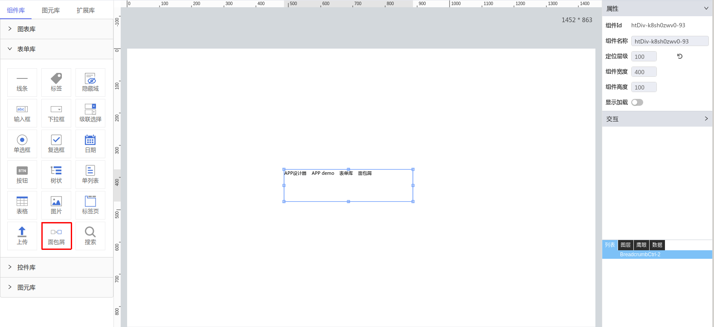

**1\. 基本信息**

{.img-fluid tag=1}


#### **组件简介**

> 名称：面包屑
>
> 功能：通过脚本控制展示面包屑
>
> 使用场景：全部

#### **属性配置**

| 属性     | 描述信息         | 类型   | 默认值 | 设值方法                   | 取值方法
| :------ | :--------------- | :----- | ------ | -------------------------- | ---------- |


#### **示例代码**

```javascript
  // 获取Id为Breadcrumb-1的元素
  var Breadcrumb = scriptUtil.getRegisterReactDom('Breadcrumb-1') 
  // 定义一个面包屑数组，按父=>子顺序组成面包屑
  var data = [{
      text: 'App'， // 必填字段 面包屑展示字段
      key: 'app', // 必填字段，唯一id
      fn: ()=>{...}, // 非必填，若有且合法，点击该层级便调用该函数
      fontSize: 18, // 非必填，字体大小，默认 14
      color: 'red', // 非必填，字体颜色，默认 #000
      fontFamily: '微软雅黑' // 非必填，字体，默认 微软雅黑
    },
    {
      text: 'page',
      key: 'page',
    },
    {
      text: 'block',
      key: 'block',
    } 
  ]
  // 手动设置面包屑渲染的内容
  Breadcrumb.setObjectData(data)
```