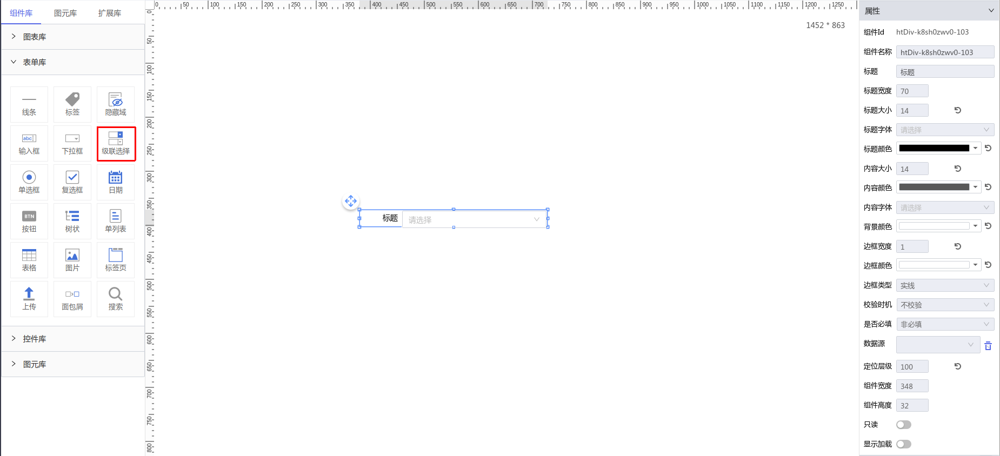

**1\. 基本信息**

{.img-fluid tag=1}


#### **组件简介**

> 名称：级联选择
>
> 功能：针对配置的数据源进行多级联动选择
>
> 使用场景：全部

#### **属性配置**

| 属性     | 描述信息         | 类型   | 默认值 | 设值方法                   | 取值方法
| :------ | :--------------- | :----- | ------ | -------------------------- | ---------- |
| 标题 |输入框前的提示文本| String | 标题 | setLabelContent |  getLabelContent
| 标题宽度 |标题的宽度| Number | 70 | setTitleWidth |  getTitleWidth
| 标题大小 |标题的字体大小| Number | 14 | setTitleFontSize |  getTitleFontSize
| 标题颜色 |标题的字体颜色| String | #000000 | setTitleColor |  getTitleColor
| 标题字体 |标题的字体| String |  | setFontFamily |  getFontFamily
| 内容大小 |内容的字体大小| Number | 14 | setContextFontSize |  getContextFontSize
| 内容颜色 |内容的字体颜色| String | rgba(0, 0, 0, 0.65) | setContextColor |  getContextColor
| 内容字体 |内容的字体| String |  | setContextFontFamily |  getContextFontFamily
| 边框宽度 |边框的宽度| Number | 1 | setBorderWidth |  getBorderWidth
| 边框颜色 |边框的颜色| String | #e3e3e3 | setBorderColor |  getBorderColor
| 边框类型 |边框的类型| String | solid | setBorderStyle |  getBorderStyle
| 背景颜色 |输入框的背景颜色| String | #ffffff | setBackgroundColor |  getBackgroundColor
| 校验时机 |作为表单提交时控制何时校验| Object | { checkTime: 'never', isRequired: 'no' } | setValidityCheck |  getValidityCheck
| 是否必填 |作为表单提交时是否必填| Object | { checkTime: 'never', isRequired: 'no' } | setValidityCheck |  getValidityCheck
| 数据源 | 配置需要展示的数据源 | Array | []      | 
#### **示例代码**

```javascript
  // 获取Id为Cascader-1的元素
  var Cascader = scriptUtil.getRegisterReactDom('Cascader-1') 
  // 定义一个级联关系数组
  var data = [{
    value: 'zhejiang',
    label: 'Zhejiang',
    children: [{
      value: 'hangzhou',
      label: 'Hangzhou',
      children: [{
        value: 'xihu',
        label: 'West Lake'
      }]
    }]
  }, {
    value: 'jiangsu',
    label: 'Jiangsu',
    children: [{
      value: 'nanjing',
      label: 'Nanjing',
      children: [{
        value: 'zhonghuamen',
        label: 'Zhong Hua Men'
      }]
    }]
  }];
  // 手动导入数据源
  Cascader.setImportData(data)
  
  // 获取当前控件的值
  var value = Cascader.getChooseOption()

  // 手动设置当前的值
  var vals = ['zhejiang','hangzhou','xihu']
  Cascader.setValue(vals)

  // 当打开必填选项时手动获取校验结果
  var res = Cascader.getValid()
```