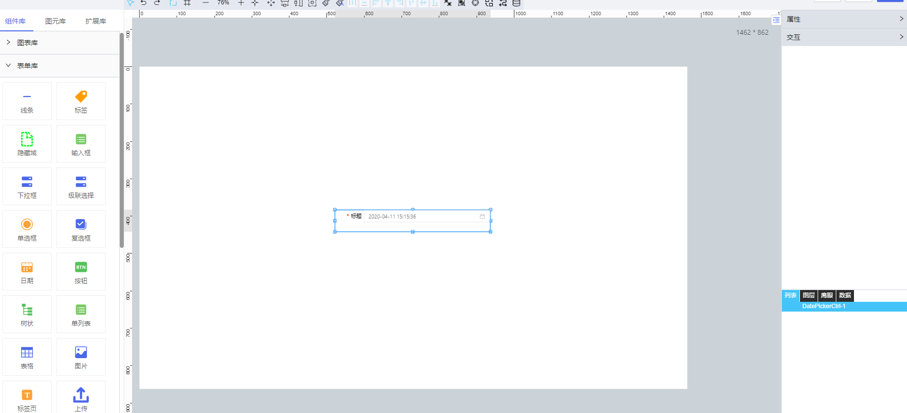

**1\. 基本信息**

{.img-fluid tag=1}

#### **组件简介**

> 名称：日期
>
> 功能：用于选择日期
>
> 使用场景：当用户需要输入一个日期，可以点击标准输入框，弹出日期面板进行选择

#### **属性配置**

| 属性    | 描述信息         | 类型   | 默认值 | 设值方法                   | 取值方法   |
| :------ | :--------------- | :----- | ------ | -------------------------- | ---------- |
| 组件 ID | 控件 ID 自动生成 | string |        |                            |            |
| 组件名称    | 控件的赋值标识符       | string |        | setFormItemId(value) | getFormItemId() |
标题|展示在左侧的自定义标题|string|标题|setLabelContent(value)|getLabelContent()
标题宽度|标题宽度|number|70|setTitleWidth(value)|getTitleWidth()
标题大小|标题大小|number|14|setTitleFontSize(value)|getTitleFontSize()
标题字体|标题字体|string||setFontFamily(value)|getFontFamily()
标题颜色|标题颜色|string|`#000`|setTitleColor(value)|getTitleColor()
內容大小|內容大小|number|14|setContextFontSize(value)|getContextFontSize()
内容颜色|内容颜色|string|`#000000a6`|setContextColor(value)|getContextColor()
内容字体|内容字体|string||setContextFontFamily(value)|getContextFontFamily()
背景颜色|背景颜色|string|`#fff`|setBackgroundColor(value)|getBackgroundColor()
边框宽度|边框宽度|number|1|setBorderWidth(value)|getBorderWidth()
边框颜色|边框颜色|string|`#e3e3e3`|setBorderColor(value)|getBorderColor()
边框类型|边框类型|string| `solid`|setBorderStyle(value)|getBorderStyle()
校验时机/是否必填|设置控件的校验时机||{checkTime: "never", isRequired: "no", validType: "none", customReg: ""}|setValidityCheck(value)|getValidityCheck()
日期类型/格式/自定义|设置日期类型/格式|[日期类型数据格式](#日期类型数据格式)|{defaultType: "date", dateType: "date", format: "YYYY-MM-DD", customFormat: ""}|setDateOpts(value)|getDateOpts()
初始值|日期初始值|number时间戳||setInitValue(value)|getInitValue()

#### **<a id="日期类型数据格式">日期类型数据格式</a>**

```json
{
    dateType: 'date', // 日期类型 date: 日期, time: 时间, datetime: 日期+时间, dateRange: 日期区间, datetimeRange: 日期+时间区间
    format: 'YYYY-MM-DD', // 日期格式 YYYY-MM-DD YYYY-M-D DD/MM/YYYY 和custom:使用自定义格式
    customFormat: '' //自定义格式
} 
```

#### **示例代码**

##### **时间戳转换日期**

```javascript
// ‘2018-12-28 00:00:00’
scriptUtil.timestampFormat(1545926400000, 'YYYY-MM-DD HH:mm:ss');
// ‘2018-12-28’
scriptUtil.timestampFormat('1545926400000', 'YYYY-MM-DD');

```

##### **日期转换时间戳**

```
// 1543939200000
scriptUtil.timestampAntiFormat('2018-12-05');

```

##### **获取选中的日期**
  
```
var DatePicker = scriptUtil.getRegisterReactDom('htDiv72');
// 时间戳：1545926400000
DatePicker.getValue();

```

##### **设置选中的日期**
  
```
var DatePicker = scriptUtil.getRegisterReactDom('htDiv72');
// 时间戳
DatePicker.setValue(1545926400000);
// 日期
DatePicker.setValue(new Date());
// 日期字符串
DatePicker.setValue('2018-12-01');
// 日期区间
DatePicker.setValue(['2018-10-10 10:10:10','2018-11-11 11:11:11']);

```

##### **获取日期控件是否校验通过**
  
```
var DatePicker = scriptUtil.getRegisterReactDom('htDiv72');
DatePicker.getValid();

```

##### **设置禁止选择日期**

```js
/**
 *  @params {string} value 禁止日期 e.g. '2018-10-10' 精确控制到时分秒：'2018-10-10 10:10:10'
 *  @params {string} type 默认start:禁止选择该日期之前 end:禁止选择该日期之后
 */
var DatePicker = scriptUtil.getRegisterReactDom('htDiv72');
DatePicker.setDisabledDate('2018-01-01 10:10:10','start')
```

##### **设置禁止选择时间** 

```js
/**
 *  @params {string} value 禁止时间 e.g. '10:10:10'
 *  @params {string} type 默认start:禁止选择该时间之前 end:禁止选择该时间之后
 */
var DatePicker = scriptUtil.getRegisterReactDom('htDiv72');
DatePicker.setDisabledTime('10:10:10','start')
```

---