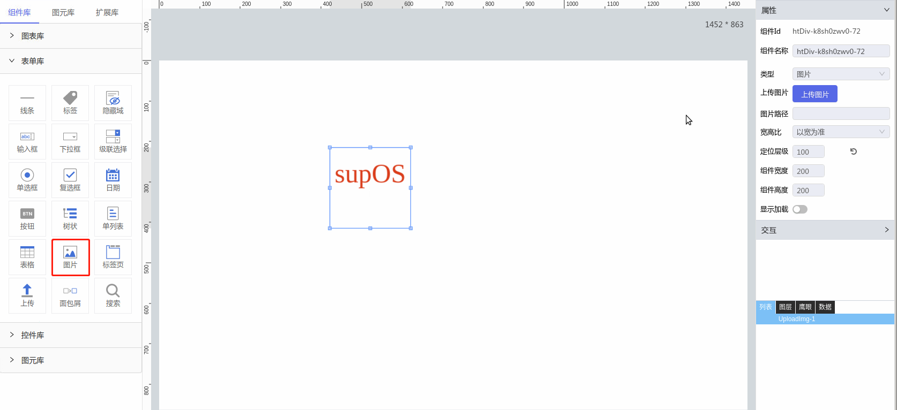

**1\. 基本信息**

{.img-fluid tag=1}


#### **组件简介**

> 名称：图片
>
> 功能：上传图片并展示
>
> 使用场景：全部

#### **属性配置**

| 属性     | 描述信息         | 类型   | 默认值 | 设值方法                   | 取值方法
| :------ | :--------------- | :----- | ------ | -------------------------- | ---------- |
| 类型 |图片或者纯色| String | picture | setType |  getType
| 图片路径 |图片文件地址| String |  | setImgUpload |  getImgUpload
| 宽高比 |图片缩放标准| String | width | setRatio |  getRatio

#### **示例代码**

```javascript
  // 获取Id为ImgUpload-1的元素
  var ImgUpload = scriptUtil.getRegisterReactDom('ImgUpload-1') 
  // 定义一个已知存在图片文件的相对路径或地址
  var imgUrl = '../../xx/xx/xxx.png'
  // 手动设置图片路径
  ImgUpload.setValue(imgUrl)
  // 手动获取已设置的图片文件的路径
  var path = ImgUpload.getValue()
```