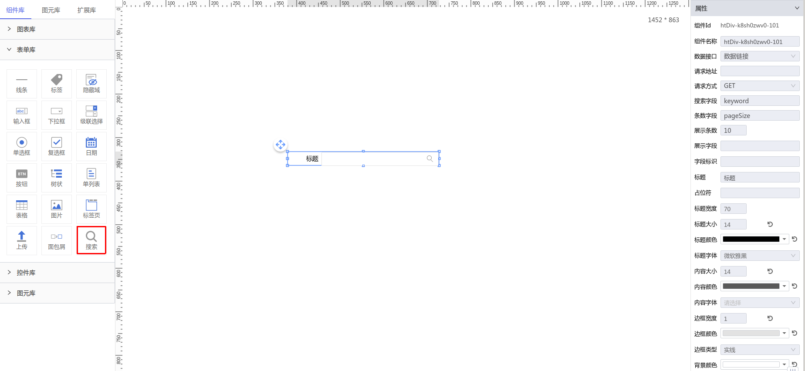

**1\. 基本信息**

{.img-fluid tag=1}


#### **组件简介**

> 名称：搜索
>
> 功能：针对配置的后端接口提供搜索功能的输入框
>
> 使用场景：全部

#### **属性配置**

| 属性     | 描述信息         | 类型   | 默认值 | 设值方法                   | 取值方法
| :------ | :--------------- | :----- | ------ | -------------------------- | ---------- |
| 数据接口 |搜索接口类型| String |  |  |  
| 请求地址 |提供搜索功能的对应接口路径| Object |  | setSelectApi |  getSelectApi
| 请求方式 |对应搜索方式的请求方式| String | GET |  |  
| 搜索字段 |传递后端对应字段名| String | keyword |  |  
| 条数字段 |传递后端对应pageSize字段名| String | pageSize |  |  
| 展示条数 |传递后端对应pageSize数量| Number | 10 |  |  
| 展示字段 |接口返回内容对应的展示字段名称| String |  | setItemValue |  getItemValue
| 字段标识 |接口返回内容对应的字段标识，要求唯一| String |  | setItemKey |  getItemKey
| 标题 |输入框前的提示文本| String | 标题 | setLabelContent |  getLabelContent
| 占位符 |输入框内的提示文本| String |  | setPlaceholder |  getPlaceholder
| 标题宽度 |标题的宽度| Number | 70 | setTitleWidth |  getTitleWidth
| 标题大小 |标题的字体大小| Number | 14 | setTitleFontSize |  getTitleFontSize
| 标题颜色 |标题的字体颜色| String | #000000 | setTitleColor |  getTitleColor
| 标题字体 |标题的字体| String | 微软雅黑 | setFontFamily |  getFontFamily
| 内容大小 |内容的字体大小| Number | 14 | setContextFontSize |  getContextFontSize
| 内容颜色 |内容的字体颜色| String | rgba(0, 0, 0, 0.65) | setContextColor |  getContextColor
| 内容字体 |内容的字体| String |  | setContextFontFamily |  getContextFontFamily
| 边框宽度 |边框的宽度| Number | 1 | setBorderWidth |  getBorderWidth
| 边框颜色 |边框的颜色| String | #e3e3e3 | setBorderColor |  getBorderColor
| 边框类型 |边框的类型| String | solid | setBorderStyle |  getBorderStyle
| 背景颜色 |输入框的背景颜色| String | #ffffff | setBackgroundColor |  getBackgroundColor
#### **示例代码**

```javascript
 目前不支持任何脚本
```