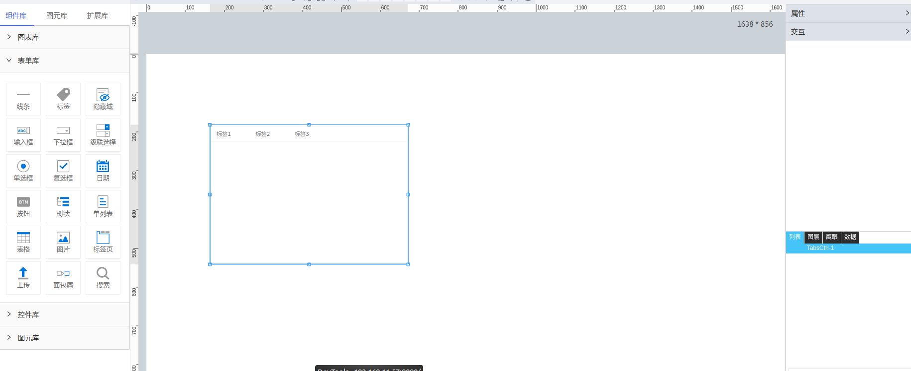

**1\. 基本信息**

{.img-fluid tag=1}

#### **组件简介**

> 名称：标签页
>
> 功能：选项卡切换组件
>
> 使用场景：

#### **属性配置**

| 属性    | 描述信息         | 类型   | 默认值 | 设值方法                   | 取值方法   |
| :------ | :--------------- | :----- | ------ | -------------------------- | ---------- |
| 组件 ID | 控件 ID 自动生成 | string |        |                            |            |
| 组件名称    | 控件的赋值标识符       | string |        | setFormItemId(value) | getFormItemId() |
| 备选类型 | 下拉选项类型   | object | 动态 | setdataSource(Object)        | getdataSource().type  |
| 动态数据 | 通过对象选择器绑定动态数据渲染下拉选项 | object | -   | setdataSource(Object)  | getdataSource().dynamicDataSource |
| 静态数据 | 手动添加数据渲染下拉选项 | object  | - | setdataSource(Object) | getdataSource().staticDataSource  |
| 时间格式 | 时间格式不做转换 | boolean | false | setInitFormat()         | getInitFormat         |

#### **公共联动配置**： [联动](../../../CommonIntro/link.md)

#### **数据格式**
```js
[
  {
    key:'tab1',  // 唯一标识符（必填）
    optionText: '标签1',  // tab名称
    optionPageValue: 'https://www.baidu.com?key=1'  // tab所对应的链接，如需参数联动，跟在链接后面，tabs对应页面中的的联动控件绑定内容加载事件即可 e.g. 'https://www.baidu.com?name=lisi&age=18'
  },
  {
    key:'tab2',
    optionText: '标签2',
    optionPageValue: 'https://www.baidu.com?key=2'
  },
  {
    key:'tab3',
    optionText: '标签3',
    optionPageValue: 'https://www.baidu.com?key=3'
  }
];
```

#### **脚本导入数据源**

```js
scriptUtil.getRegisterReactDom('控件id').setImportData(data)
```

data数据格式同上

### 脚本获取已选tab

```js
scriptUtil.getRegisterReactDom('控件id').getChooseOption()
``` 

返回数据格式:
```
{
  key:'tab2',
  optionText: '标签2',
  optionPageValue: 'https://www.baidu.com?key=2'
}
```

#### **脚本设置当前tab**

```js
scriptUtil.getRegisterReactDom('控件id').setActiveKey(key)  // key 对应tab的唯一标识符
``` 

返回数据格式:
```
{
  key:'tab2',
  optionText: '标签2',
  optionPageValue: 'https://www.baidu.com?key=2'
}
```
