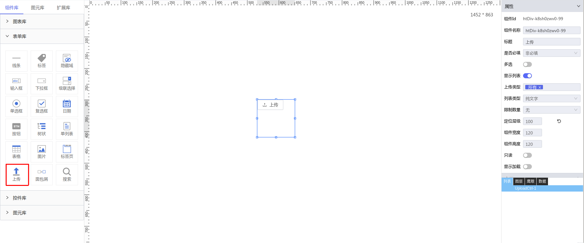

**1\. 基本信息**

{.img-fluid tag=1}


#### **组件简介**

> 名称：上传
>
> 功能：上传文件的按钮
>
> 使用场景：全部

#### **属性配置**

| 属性     | 描述信息         | 类型   | 默认值 | 设值方法                   | 取值方法
| :------ | :--------------- | :----- | ------ | -------------------------- | ---------- |
| 标题 |按钮内的提示文本| String | 上传 | setLabelContent |  getLabelContent
| 是否必填 |作为表单页中控件是控制是否必填(yes or no)| String | no | setIsRequired |  getIsRequired
| 多选 |上传文件是否支持多选| Boolean | false | setMultiple |  getMultiple
| 显示列表 |是否显示文件列表| Boolean | true | setShowList |  getShowList
| 上传类型 |上传文件类型控制| String | * | setAcceptType |  getAcceptType
| 列表类型 |列表展现形式| String | text | setListType |  getListType
| 限制数量 |上传文件限制的数量| Number | -1(无限制) | setLimitNum |  getLimitNum
| 只读 |是否只读| Boolean | false | setReadOnly |  getReadOnly
#### **示例代码**

```javascript
  // 获取Id为Upload-1的元素
  var Upload = scriptUtil.getRegisterReactDom('Upload-1')
  // 当打开必填选项时手动获取校验结果
  var res = Upload.getValid()
```