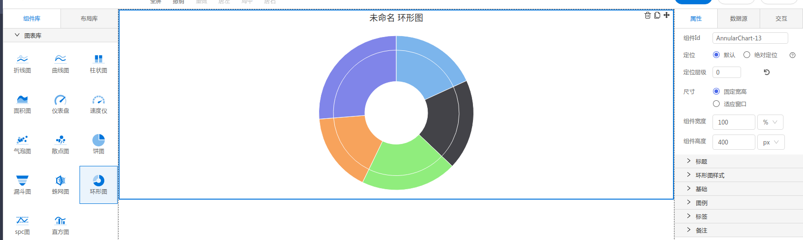

<h2></h2>

---

**1\. 基本信息**

{.img-fluid tag=1}

#### **组件简介**

> 名称：环形图
>
> 功能：展现数据变化
>
> 使用场景：全部

#### **图表公共属性配置**： [配置](./chart.md)

#### **环形图属性**

| 属性| 描述信息| 类型| 默认值 | 设值方法 | 取值方法|  脚本使用 |
|-----|--------|----|--------|--------|----------|-----|
| 基础-定时刷新 |  | number | undefined | setTimer | getTimer |  |
| 类型 |  | string | 'pie' | setType | getType | 允许 |
| 样式 |  | object | {  borderWidth:1, innerSize:'0%', slicedOffset:10 } | setPiePeculiarity | getPiePeculiarity |  |
| 标签-标签位置 |  | number | 30 | setDistance | getDistance |  允许 |