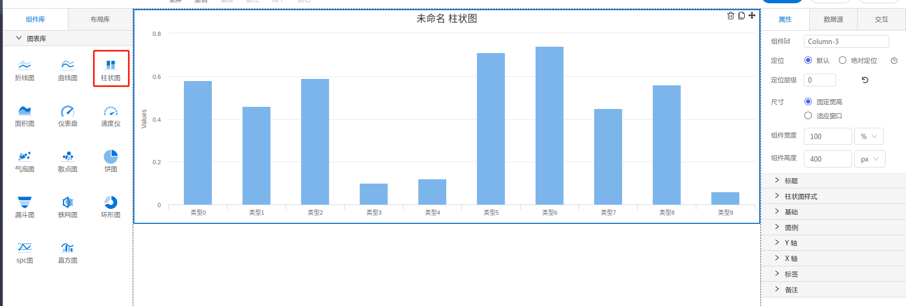

<h2></h2>

---

**1\. 基本信息**

{.img-fluid tag=1}

#### **组件简介**

> 名称：柱状图
>
> 功能：展现数据变化
>
> 使用场景：全部

#### **图表公共属性配置**： [配置](./chart.md)

#### **柱状图属性**

| 类型 | 属性| 描述信息| 类型| 默认值 | 设值方法 | 取值方法|  脚本使用 |
|-----|--------|----|--------|--------|----------|-----|-----|
| 基础 | 切换类型 |切换折线图内所有线型类型 | boolean | false | setCutType | getCutType |
| 基础 | 定时刷新 | | number | 0 | setTimer | getTimer |
| 柱状图样式 | 堆叠 |  | string | null | setStacking | getStacking |
| 柱状图样式 | 预警 |  | object | { min: undefined, max: undefined, color:'red', enabled:false } | setChartEarly | getChartEarly | 允许 |
| 柱状图样式 | 柱宽 |  | number | 20 | setPointWidth | getPointWidth | 允许 |
| 柱状图样式 | 圆角 |  | number | 0 | setSeriesBorderRadius | getSeriesBorderRadius | 允许 |
| 柱状图样式 | 网格 |  | number | 0 | setShowGrid | getShowGrid | 允许 |
| 柱状图样式 | 坐标反转 |  | number | 0 | setAxisReversal | getAxisReversal |  |
| X轴 | 显示X轴 |  | boolean | true | setXAxisVisible | getXAxisVisible | 允许 |
| X轴 | 标题 |  | string | undefined | setXAxisTitle | getXAxisTitle | 允许 |
| X轴 | 文本样式 |  | object | {fontSize:12, fontFamily:'微软雅黑', color：'#000', fontWeight:'normal', fontStyle:'initial'} | setXAxisTitleStyle | getXAxisTitleStyle | 允许 |
| X轴 | 标题位置 |  | string | 'middle' | setXAxisTitleAlign | getXAxisTitleAlign | 允许 |
| X轴 | 轴线颜色 |  | string | '#ccd6eb' | setxAxisColor | getxAxisColor | 允许 |
| X轴 | 轴字颜色 |  | string | '#666' | setXAxisLablesStyle | getXAxisLablesStyle | 允许 |
| X轴 | 旋转角度 |  | number | 0 | setXAxisRotation | getXAxisRotation | 允许 |
| X轴 | 竖拍文字 |  | boolean | false | setXAxisWritingMode | getXAxisWritingMode | 允许 |
| Y轴 | 显示Y轴 |  | boolean | true | setYAxisVisible | getYAxisVisible | 允许 |
| Y轴 | 单位 |  | string | undefined | setYAxisFormat | getYAxisFormat | 允许 |
| Y轴 | 网格线 |  | number | 0 | setYGrid | getYGrid | 允许 |
| Y轴 | 准星线 |  | boolean | false | setYAxisCrosshair | getYAxisCrosshair | 允许 |
| Y轴 | 刻度 |  | object | { min: null, tickInterval: undefined } | setYAxisScale | getYAxisScale |
| Y轴 | 标题 |  | string | undefined | setYAxisTitle | getYAxisTitle | 允许 |
| Y轴 | 文本样式 |  | object | {fontSize:12, fontFamily:'微软雅黑', color：'#000', fontWeight:'normal', fontStyle:'initial'} | setYAxisTitleStyle | getYAxisTitleStyle | 允许 |
| Y轴 | 标题位置 |  | string | 'middle' | setYAxisTitleAlign | getYAxisTitleAlign | 允许 |
| Y轴 | 轴字颜色 |  | string | '#666' | setYAxisLablesStyle | getYAxisLablesStyle | 允许 |
| Y轴 | 旋转角度 |  | number | 0 | setYAxisRotation | getYAxisRotation | 允许 |
| Y轴 | 最大值 |  | number | undefined | setYAxisMax | getYAxisMax |

