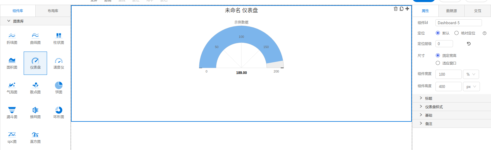

<h2></h2>

---

**1\. 基本信息**

{.img-fluid tag=1}

#### **组件简介**

> 名称：仪表盘
>
> 功能：展现数据变化
>
> 使用场景：全部

#### **图表公共属性配置**： [配置](./chart.md)

#### **仪表盘属性**

| 属性| 描述信息| 类型| 默认值 | 设值方法 | 取值方法|  脚本使用 |
|-----|--------|----|--------|--------|----------|-----|
| 表盘颜色 |  | string | '#fff' | setPanelBackgroundColor | getPanelBackgroundColor |
| 盘边颜色/宽度 |  | object | {borderColor: '#ddd', borderWidth: 1} | setPanelBorderColorWidth | getPanelBorderColorWidth |
| 刻度分隔/最大值/起止角度/结束角度 |  | object | {tickAmount:4, max:200, startAngle:-90, endAngle:90} | setDialCof | getDialCof |
| 刻度颜色 |  | string | '#333' | setTickColor | getTickColor | 允许 |
| 字体颜色 |  | string | '#666' | setYAxisLablesStyle | getYAxisLablesStyle | 允许 |
| 表盘内径 |  | number | 60 | setPaneWidth | getPaneWidth | 允许 |