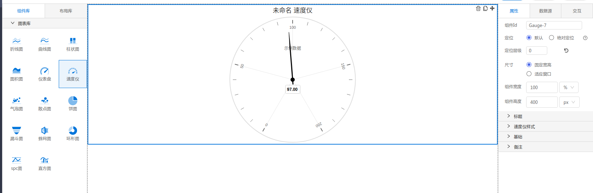

<h2></h2>

---

**1\. 基本信息**

{.img-fluid tag=1}

#### **组件简介**

> 名称：仪表盘
>
> 功能：展现数据变化
>
> 使用场景：全部

#### **图表公共属性配置**： [配置](./chart.md)

#### **速度仪属性**

| 属性| 描述信息| 类型| 默认值 | 设值方法 | 取值方法|  脚本使用 |
|-----|--------|----|--------|--------|----------|-----|
| 定时刷新 |  | number | undefined | setTimer | getTimer |
| 表盘颜色 |  | string | '#fff' | setPanelBackgroundColor | getPanelBackgroundColor |
| 盘边颜色/宽度 |  | object | {borderColor: '#ddd', borderWidth: 2} | setPanelBorderColorWidth | getPanelBorderColorWidth |
| 刻度分隔/最大值/起止角度/结束角度 |  | object | {tickAmount:5, max:200, startAngle:-150, endAngle:150} | setDialCof | getDialCof |
| 刻度颜色 |  | string | '#666' | setTickColor | getTickColor | 允许 |
| 刻度长度 |  | number | 10 | setTickExtent | getTickExtent | 允许 |
| 字体颜色 |  | string | '#666' | setYAxisLablesStyle | getYAxisLablesStyle | 允许 |
| 横向偏移/纵向偏移 |  | object | {xAxisDeviation:50, yAxisDeviation:50} | setPanelCenterPostion | getPanelCenterPostion | 允许 |
| 标示区域 |  | object | [] | setPlotBands | getPlotBands | 
| 源点颜色/源点半径 |  | object | {backgroundColor:'#000', radius:5} | setPivotColorRadius | getPivotColorRadius |  允许 |
| 边框颜色/边框半径 |  | object | { borderColor:'#000000', borderWidth:2 } | setGaugeBorderColorWidth | getGaugeBorderColorWidth |  允许 |
| 尾部长度 |  | number | underfined | setRearLength | getRearLength | 允许 |
| 表盘内径 |  | number | 60 | setPaneWidth | getPaneWidth | 允许 |
| 显示名 |  | boolean | true | setGaugeLabelsEnabled | getGaugeLabelsEnabled | 允许 |
| 连接刻度 |  | boolean | true | setBackgroundShape | getBackgroundShape | 允许 |