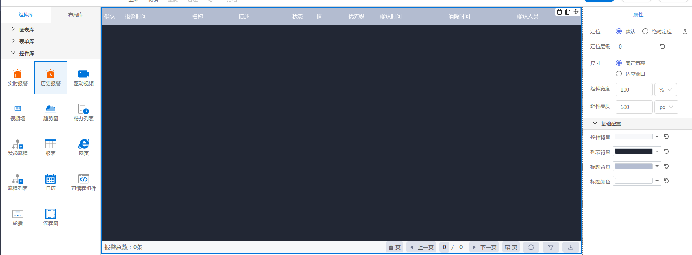

<h2></h2>

---

**1\. 基本信息**

{.img-fluid tag=1}


#### **组件简介**

> 名称：历史报警
>
> 功能：查看历史异常数据
>
> 使用场景：全部

#### **属性配置**

| 属性   | 描述信息 | 类型     | 默认值      | 设值方法                 | 取值方法                 |
|------|------|--------|----------|----------------------|----------------------|
| 控件背景 |      | string | '#f7f8fa' | setColorConfig({ConpontBackground:{color: string}}) | getColorConfig().ConpontBackground |
| 列表背景 |      | string | '#222734' | setColorConfig({ListBackground:{color: string}})     |  getColorConfig().ListBackground    |
| 标题背景 |      | string | '#b4bdd1' | setColorConfig({TitleBackground:{color: string}})    |  getColorConfig().TitleBackground   |
| 标题颜色 |      | string | '#ffffff' | setColorConfig({TitleColor:{color: string}})         |  getColorConfig().TitleColor        |

```javascript
  // 脚本设置标题颜色
  var ColorConfig  = this.getColorConfig();
  this.setColorConfig({
    ...ColorConfig,
    TitleColor: { color: this.config.TitleColor }
  })
```

#### **示例代码**

```javascript
  目前不支持任何脚本
```
