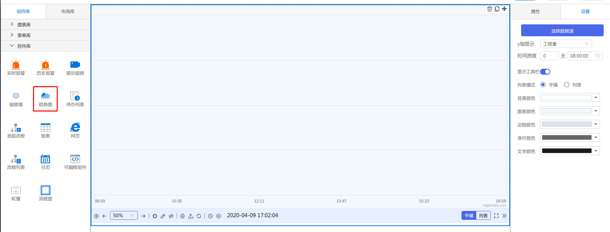

<h2></h2>

---

**1\. 基本信息**

{.img-fluid tag=1}


#### **组件简介**

> 名称：趋势图
>
> 功能：查看数据动态，和历史趋势
>
> 使用场景：全部

#### **属性配置**

| 属性    | 描述信息       | 类型      | 默认值                       | 设值方法                    | 取值方法                    |
|-------|------------|---------|---------------------------|-------------------------|-------------------------|
| 数据源   | 配置需要展示的数据源 | array   | \[\]                      | setDataSource           | getDataSource           |
| y轴显示  | 工程量、百分比    | string  | '1'                       | setDataSource           | getDataSource           |
| 时间跨度  | x轴横跨时间     | number  | 28800000                  | setDataSource           | getDataSource           |
| 显示工具栏 | 是否显示工具栏    | boolean | true                      | setToolBarShow          | getToolBarShow          |
| 列表平铺  | 展示区样式      | string  | '1'                        | setShowListType         | getShowListType         |
| 背景颜色  |            | string  | '#FFFFFF'                | setDivBackgroundColor   | getDivBackgroundColor   |
| 图表颜色  |            | string  | rgba\(159,194,255,0\.12\) | setChartBackgroundColor | getChartBackgroundColor |
| 边框颜色  |            | string  | '#cccccc'                  | setBorderColor          | getBorderColor          |
| 滑竿颜色  |            | string  | '#666666'                  | setCrosshairColor       | getCrosshairColor       |
| 文字颜色  |            | string  | '#666666'                  | setTextColor            | getTextColor            |


#### **示例代码**

```javascript
  // mock数据源
  var obj = [
      { color:"#009DD7",name:"mock_demo:mock1", primitiveType:"Float"},
      { color:"#39435A",name:"mock_demo:mock2", primitiveType:"Double"}
  ]

  // 获取Id为TrendChart-1的元素
  var TrendChart1 = window.supQuery.getInstanceById('TrendChart-1'); 

  // 显示工具栏
  TrendChart1.setToolBarShow(true);

  // 列表平铺
  TrendChart1.setShowListType("2");

  // 背景颜色
  TrendChart1.setDivBackgroundColor('red');

  // 图表颜色
  TrendChart1.setChartBackgroundColor('red');

  // 边框颜色
  TrendChart1.setBorderColor('red');

  // 滑竿颜色
  TrendChart1.setCrosshairColor('red');

  // 文字颜色
  TrendChart1.setTextColor('red');

  // 脚本添加数据源（在不满8条情况下允许插入，满8条后，剩余数据源作废）
  // 单数据源{} 多数据源[] name&primitiveType&color必传
  TrendChart1.setObjectData(obj)
```
