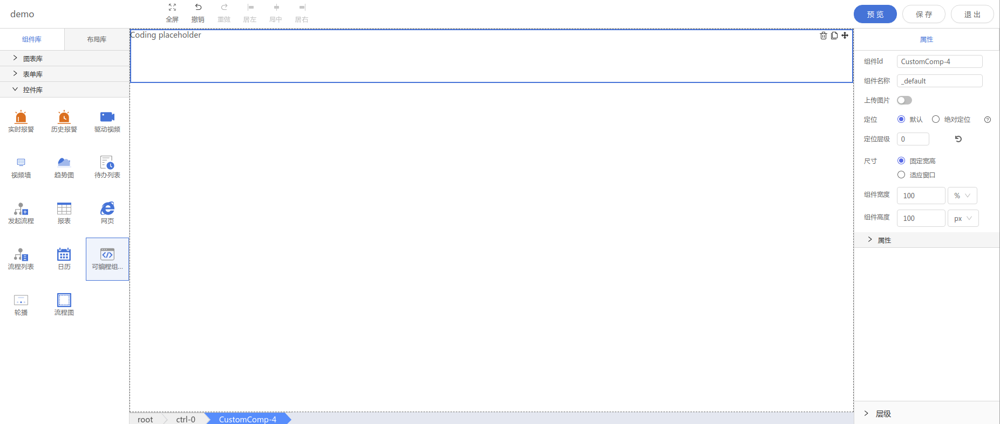

<h2></h2>

---

**1\. 基本信息**

{.img-fluid tag=1}

#### **组件简介**

> 名称：可编程控件
>
> 功能：可以通过js代码实现用户自定义需求的组件
>
> 使用场景： 任意场景

#### **属性配置**

| 属性     | 描述信息           | 类型   | 默认值    | 设值方法                   | 取值方法               |
| :------- | :----------------- | :----- | --------- | -------------------------- | ---------------------- |
| 组件名称 | 组件的名称         | String | \_default | setComponentName(String)   | getComponentName()     |
| 上传图片 | 是否展示运行期效果 | Bool   | false     | setIsPreviewInDesign(Bool) | getIsPreviewInDesign() |
