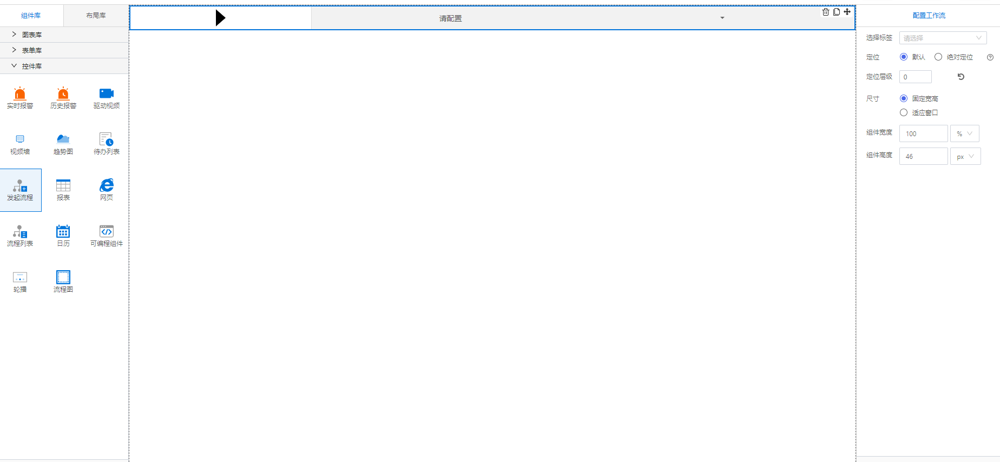

<h2></h2>

---

**1\. 基本信息**

{.img-fluid tag=1}

#### **组件简介**

> 名称：发起流程
>
> 功能：快速发起某标签对应的工作流
>
> 使用场景：

#### **属性配置**

| 属性    | 描述信息         | 类型   | 默认值 | 设值方法                   | 取值方法   |
| :------ | :--------------- | :----- | ------ | -------------------------- | ---------- |
| 选择标签    | 绑定需要发起的工作流标签       | string |        | setTag(value)|getTag()
