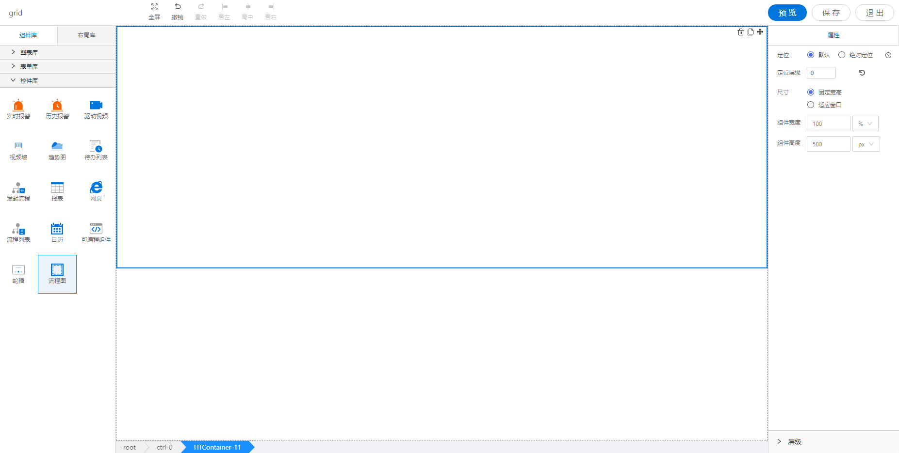

<h2></h2>

---

**1\. 基本信息**

{.img-fluid tag=1}

#### **组件简介**

> 名称：流程图
>
> 功能：用于绘制工业流程图组件
>
> 使用场景：设备监控信息页面，动态数据展示

#### **属性配置**

<a href="../../../CommonIntro/commonProp.md" target="_blank">**公共属性的配置**</a>
