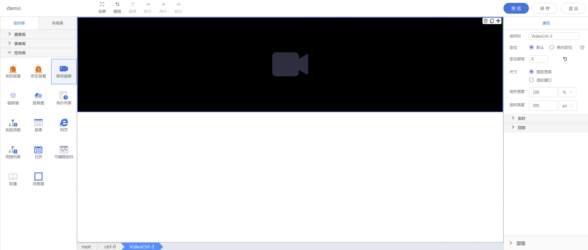

<h2></h2>

---

**1\. 基本信息**

{.img-fluid tag=1}

#### **组件简介**

> 名称：驱动视频
>
> 功能：视频播放控件
>
> 使用场景： 视频监控页面，现场大屏

#### **属性配置**

| 属性     | 描述信息         | 类型   | 默认值 | 设值方法                 | 取值方法           |
| :------- | :--------------- | :----- | ------ | ------------------------ | ------------------ |
| 自动播放 | 是否自动播放视频 | Boole  | true    | setStreamSource({autoPlay:bool})    | getStreamSource().autoPlay     |
| 视频轮播 | 是否轮流播放视频 | Object |        | setStreamSource(Object)  | getStreamSource()  |
| 实时播放 | 实时视频数据     | Object |        | setHistorySource(Object) | getHistorySource() |

#### **示例代码**

```javascript
// 设置视频轮播数据
  instance.setStreamSource({
    autoPlay: true, // 自动播放
    carousel: false, // 是否轮播
    maxchannel: null, // 最多频道
    chooseChannel: undefined, // 选择频道
    cameramodel: null, // 视频模式
    manufacturer: null, // 制造商
    videoSource: '' // 视频源数据
  })
// 设置实时回放数据
  instance.setHistorySource({
    videoSource: '' // 视频源数据
  })

```
