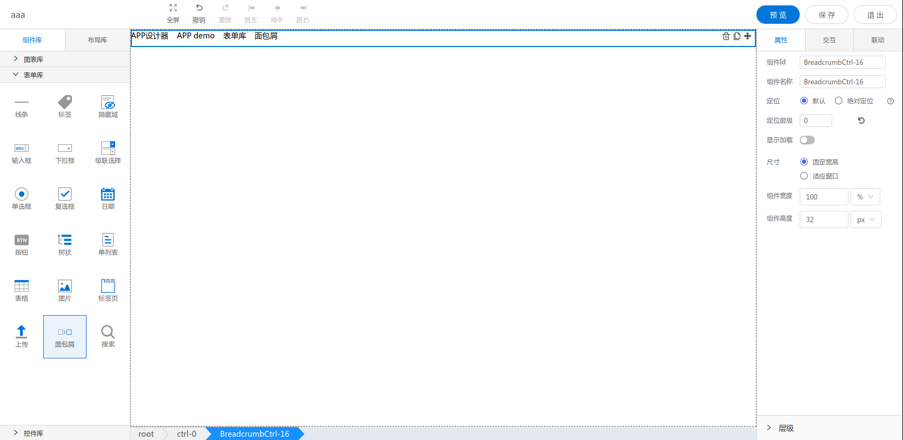

<h2>面包屑</h2>

---

**1\. 基本信息**



#### **组件简介**

> 名称：面包屑
>
> 功能：用于展示页面层级结构
>
> 使用场景：

#### **属性配置**

| 属性    | 描述信息         | 类型   | 默认值 | 设值方法                   | 取值方法   |
| :------ | :--------------- | :----- | ------ | -------------------------- | ---------- |
| 组件 ID | 控件 ID 自动生成 | string |        |                       |            |
| 组件名称    | 表单标识ID, 联动组件列表显示的名称       | string |  | setFormItemId | getFormItemId |

#### **联动配置**
| 类型     | 方法       | 返回数据(作为源)/ 方法赋值（作为目标）| 编辑格式（作为源-返回的数据处理）| 源字段(作为源) | 描述 |
| -------- | -------- | ------------------ | ---------------- | ----- | ---- |
| 作为源	| 点击 | 点击的文本 | 无 | 无 | 点击的文本内容 |
| 作为目标 | 无 | | |  |  |

#### **示例代码**

```javascript
  // 获取Id为BreadCrumbCtrl-1的元素
  var breadCrumbCtrl = window.supQuery.getInstanceById('BreadCrumbCtrl-1');

  // 组件名称
  breadCrumbCtrl.setFormItemId('BreadCrumbCtrl-1');
  const ctrlName = breadCrumbCtrl.getFormItemId();

  // 设置数据源
  breadCrumbCtrl.setObjectData([
      {
          key: 'item1',  // key标识
          text: '首页',  // 显示名称
          fontSize: 17,  // 字体大小
          color: 'red',  // 字体颜色
          fontFamily: '微软雅黑', // 字体
          fn: function() {}, // 点击该项回调方法
      }
  ])
```
