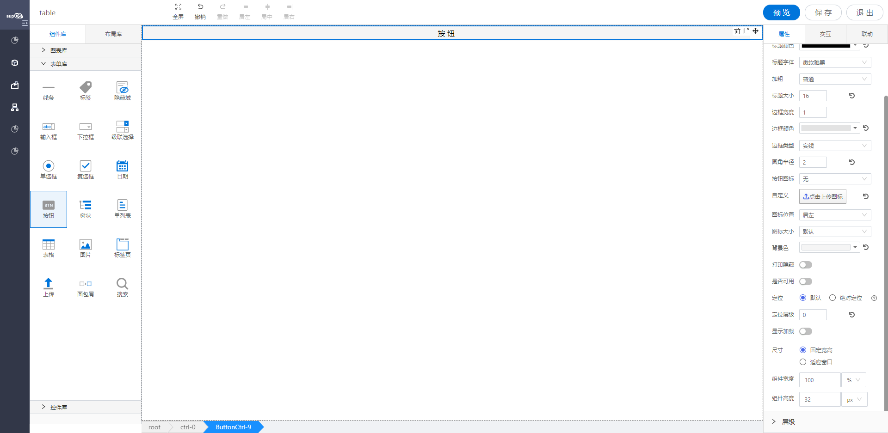

<h2>按钮</h2>

---

**1\. 基本信息**

{.img-fluid tag=1}

#### **组件简介**

> 名称：按钮
>
> 功能：按钮触发事件
>
> 使用场景：搜索/ 添加 / 编辑等情况

#### **属性配置**

| 属性       | 描述信息                | 类型                          | 默认值        | 设值方法                     | 取值方法               |
| ---------- | ---------------------- | ----------------------------- | ------------- | ---------------------------- | ---------------------- |
| 组件ID     | 控件的组件名称，用于联动key和表单提交       | Object          |         |                              |                        |
| 组件名称   | 控件的赋值标识符，在表单中， 代表数据存储的key值 | Object    |    | setFormItemId\({value: String}\)      | getFormItemId\(\).value      |
| 按钮标题   | 按钮的文字                | Object        | 按钮          | setButtonName\({value: String}\)            | getButtonName\(\).value      |
| 标题颜色   | 按钮标题的颜色             | Object        | \#000000      | setTitleColor\({color: String}\)            | getTitleColor\(\).color      |
| 标题字体   | 标题的字体                 | Object       | 微软雅黑      | setTitleFontFamily\({value: String}\)       | getTitleFontFamily\(\).value |
| 加粗       | 标题是否加粗               | { value: 'normal' /  'bold'}    | 普通          | setFontWeight\({value: String}\)            | getFontWeight\(\).value      |
| 标题大小   | 标题字体大小                | Object                | 16            | setTitleFontSize\({value: number}\)   | getTitleFontSize\(\).value   |
| 边框宽度   | 默认边框大小为1，可自定义     | Object                | 边框大小为1   | setBorderWidth\({value: number}\)     | getBorderWidth\(\).value     |
| 边框颜色   | 边框颜色可自定义配置         | Object                 | \#F5F5F5      | setBorderColor\({color: String}\)     | getBorderColor\(\).color     |
| 边框类型   | 默认为实线，边框类型：实线、点线、虚线| {value: 'solid' / 'dotted' / 'dashed' }| 实线: 'solid' | setBorderStyle\({value: String}\)  | getBorderStyle().value  |
| 圆角半径   | 按钮的圆角                  | Object                | 2             | setBorderRadius\({value: number}\)    | getBorderRadius\(\).value    |
| 按钮图标   | 按钮的图标                  | Object                | 无            | setIcon\({value: String}\)            | getIcon\(\).value            |
| 自定义图标 | 可以自定义按钮的图标          | Object                | 无            | setIconUpload\({value: String}\)      | getIconUpload\(\).value      |
| 图标位置   | 自定义图标的显示位置          | Object                | 居左          | setIconPos\({value: String}\)         | getIconPos\(\).value         |
| 图标大小   | 自定义图标的大小             | Object                | 默认          | setIconSize\({value: String}\)        | getIconSize\(\).value        |
| 背景色     | 按钮的背景颜色               | Object                | \#F5F5F5      | setBackgroundColor\({color: String}\) | getBackgroundColor\(\).color |
| 打印隐藏   | 打印的时候是否隐藏            | Object               | false         | setPrintHidden\({value: boolean}\)    | getPrintHidden\(\).value     |
| 是否可用   | 是否点击无效，不可用           | Object               | false         | setDisabled\({value: boolean}\)       | getDisabled\(\).value        |

#### **公共属性配置**： [定位/尺寸/组件宽高设置](../../../CommonIntro/commonProp.md)

#### **公共交互配置**： [交互配置](../../../CommonIntro/action.md)

#### **公共联动配置**： [联动](../../../CommonIntro/link.md)

#### **联动配置**

| 类型     | 方法   | 描述信息           | 返回数据（作为源） | 方法赋值（作为目标） |
| -------- | ------ | ------------------ | ------------------ | -------------------- |
| 作为源   | 单击   | 单击触发           | 单击触发           | \-                   |
| 作为源   | 双击   | 双击触发           | 双击触发           | \-                   |
| 作为目标 | 存储值 | 存储源传过来的数据 | \-                 | 存储值               |

#### 按钮点击搜索的联动：

 1. ( 表单类：输入框/选择框/搜索框等) + 按钮控件 + （数据源类：有绑定数据源的控件（Radio/checkBox/tableCtrl/））；

 2. 将表单类联动到 按钮（存储值）

 3. 将按钮联动到数据源类（请求数据/查询）
