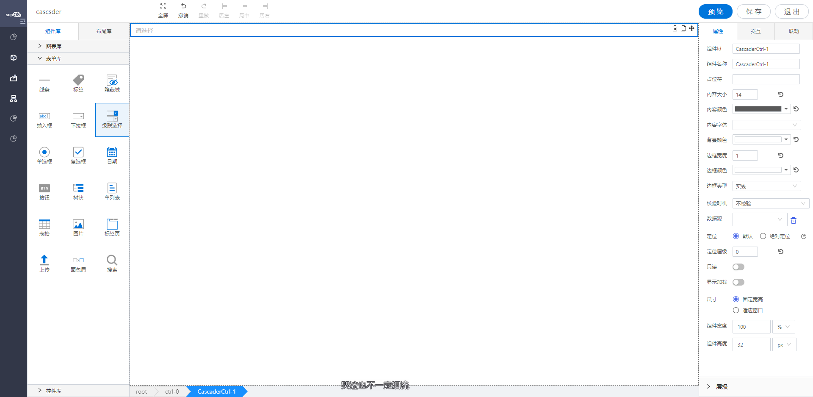

<h2></h2>

---

**1\. 基本信息**

{.img-fluid tag=1}

#### **组件简介**

> 名称：级联选择
>
> 功能：用于多层数据的选择
>
> 使用场景：省市区的选择等

#### **属性配置**

| 属性     | 描述信息                                      | 类型             | 默认值            | 设值方法               | 取值方法                      |
| :------- | :------------------------------------------ | :---------------| ---------------- | ---------------------- | ----------------------------- |
| 组件ID   | 控件的组件名称，用于联动key和表单提交            | String             | 标题                |                          |                               |
| 组件名称 | 控件的赋值标识符，在表单中， 代表数据存储的key值 | Object           |                     | setFormItemId({value:String})    | getFormItemId().value               |
| 占位符   | 输入框中的占位符提示                 | Object             |                     | setPlaceHolder({value:String})   | getPlaceHolder().value              |
| 内容文本 | 内容的大小/颜色/字体    | Object  | 14 /  'rgba\(0, 0, 0, 0\.65\)' /  微软雅黑 | setContextText\({fontSize: number, color: string, fontFamily: string}\) |getContextText\(\)  |
| 边框宽度 | 边框的宽度                           | Object             | 1                   | setBorderWidth({value:Number})            | getBorderWidth().value                |
| 边框颜色 | 边框的颜色                           | Object             | #e3e3e3             | setBorderColor({color:String})            | getBorderColor().color                |
| 边框类型 | 边框的类型                           | Object             | solid               | setBorderStyle({value:String})            | getBorderStyle().value                |
| 背景颜色 | 输入框的背景颜色                      | Object             | #ffffff             | setBackgroundColor({color:String})        | getBackgroundColor().color            |
| 校验时机 | 作为表单提交时控制何时校验              | 'never' / 'Change' | 'never'             | setValidityCheck(object) | getValidityCheck().checkTime  |
| 是否必填 | 作为表单提交时是否必填                 | 'yes' / 'no'       | 'no'                | setValidityCheck(object) | getValidityCheck().isRequired |
| 数据源   | 配置需要展示的数据源                  | object             | Object              | setDataSource(object)    | getDataSource(object)         |


#### **联动配置**

| 类型     | 方法     | 描述                         | 返回数据(作为源)       | 方法赋值（作为目标） |
| -------- | -------- | ---------------------------- | ---------------------- | -------------------- |
| 作为源   | 初始化   | 各种方式初始化设置值之后触发 | 初始化的值             |                      |
| 作为源   | 值改变   | 点击选中当前控件的数据       | 点击选中当前控件的数据 |                      |
| 作为目标 | 设置选中 | 源数据的数据设置成该控件的值 |                        | 设置该控件的值       |
| 作为目标 | 查询     | 重新获取绑定数据源的数据     |                        | 查询数据             |

#### **联动自定义配置项**

| 格式转换（作为源\-返回的数据处理） | 源字段（作为源）                                      |
| ---------------------------------- | ----------------------------------------------------- |
| 自定义                             | label ： 获取数据中的label; value ：获取数据中的value |

#### **公共联动配置**： [联动](../../../CommonIntro/link.md)

#### **公共属性配置**： [定位/尺寸/组件宽高设置](../../../CommonIntro/commonProp.md)

#### **公共交互配置**： [交互配置](../../../CommonIntro/action.md)

#### **示例代码**

##### **导入数据源**

 - 通过动态绑定数据源数据格式：

```
{
  list:[{
    value: 'zhejiang',
    label: 'Zhejiang',
    children: [{
      value: 'hangzhou',
      label: 'Hangzhou',
      children: [{
        value: 'xihu',
        label: 'West Lake'
      }]
    }]
  }, {
    value: 'jiangsu',
    label: 'Jiangsu',
    children: [{
      value: 'nanjing',
      label: 'Nanjing',
      children: [{
        value: 'zhonghuamen',
        label: 'Zhong Hua Men'
      }]
    }]
  }];
}

```

##### **通过脚本设置数据**

```
var list = [
  {
    value: 'zhejiang',
    label: 'Zhejiang',
    children: [{
      value: 'hangzhou',
      label: 'Hangzhou',
      children: [{
        value: 'xihu',
        label: 'West Lake'
      }]
    }]
  }, 
  {
    value: 'jiangsu',
    label: 'Jiangsu',
    children: [{
      value: 'nanjing',
      label: 'Nanjing',
      children: [{
        value: 'zhonghuamen',
        label: 'Zhong Hua Men'
      }]
    }]
  }
]

instance.setImportData(list);
```

##### **获取值**
```
   instance.getValue();
```

##### **设置值**
```
   var value = ['zhejiang','hangzhou','xihu']; // 设置的数据是Array格式
   instance.setValue(value);
```