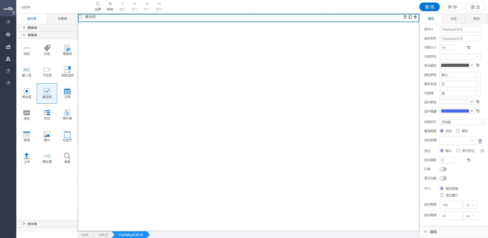

<h2>复选框</h2>

---

**1\. 基本信息**

{.img-fluid tag=1}

#### **组件简介**

> 名称：复选框
>
> 功能：用于选项多选
>
> 使用场景：

#### **属性配置**

| 属性     | 描述信息                | 类型                         | 默认值                | 设值方法         | 取值方式                |
| -------- | ----------------------| ---------------------------- | ------------------- | --------------- | ---------------------- |
| 组件id   | 该控件唯一标识，         |                              |                      |                |                          |
| 组件名称 | 控件的组件名称，用于联动key和表单提交        | Object       |         | setFormItemId\({value:String}\)  | getFormItemId\(\).value     |
| 内容文本 | 下拉框框内内容的大小/颜色/字体    | Object  | 14 /  'rgba\(0, 0, 0, 0\.65\)' /  微软雅黑 | setContextText\({fontSize: number, color: string, fontFamily: string}\) |getContextText\(\)  |
| 是否全选 | 无            | {value: 'no' / 'yes'  }           | no                    | setHasAllChecked\({value:String}\)               | getHasAllChecked\(\).value        |
| 校验时机 | 运行期是否对控件输入框内进行校验或者选择什么时机进行检验 | object          |      | setValidityCheck\(object\)        | getValidityCheck\(\)                 |
| 是否必填 | 运行期控件输入框内内容是否必填     | string       |                    | setValidityCheck\(object\)               | getValidityCheck\(\)\.isRequired     |
| 备选类型 | 下拉选项类型                     | object        |                  | setDataSource\(object\)                  | getDataSource\(\)\.type              |
| 动态数据 | 通过对象选择器绑定动态数据渲染下拉选项    | object    |                 | setDataSource\(object\)                  | getDataSource\(\)\.staticDataSource  |
| 静态数据 | 手动添加数据渲染下拉选项                | object    |                 | setDataSource\(object\)                  | getDataSource\(\)\.dynamicDataSource |
| 只读     | 表单控件的只读选项    | Object         | false                 | setReadOnly\({value: Boolean}\)                   | getReadOnly\(\).value             |
| 显示加载 | 运行期是否显示加载动画    | Object      | false                 | setIsShowLoading\({value: Boolean}\)              | getIsShowLoading\(\).value         |

#### **属性配置- 勾选框**
| 属性     | 描述信息                | 类型                         | 默认值                | 设值方法         | 取值方式                |
| -------- | ----------------------| ---------------------------- | ------------------- | --------------- | ---------------------- |
| 勾选框   | 有 /无          | {value: 'no' / 'yes' }       | no    | setCheckboxTypeConfig\({hasIcon:String}\)      | getCheckboxTypeConfig\(\).hasIcon             |
| 选中颜色 | 无勾选框: 选中选项后按钮的字体颜色 | Object    |    | setCheckboxTypeConfig\({labelCheckedColor: String}\)  | getCheckboxTypeConfig\(\).labelCheckedColor   |
| 选中背景 | 无勾选框: 选中选项后按钮的背景色  | Object     |    | setCheckboxTypeConfig\({labelCheckedBackgroundColor: String}\) | getCheckboxTypeConfig\(\).labelCheckedBackgroundColor   |
| 描边颜色 | 有勾选框：紫 蓝 黄 绿 红 | {value: '' / 'purple' / 'blue'/ 'yellow' / 'green' / 'red'} | ''  | setCheckboxTypeConfig\({checkedBackground:String}\)| getCheckboxTypeConfig\(\).checkedBackground|

```javascript
  // 设置成 有勾选框
  const CheckboxTypeConfig = instance.getCheckboxTypeConfig();
  instance.setCheckboxTypeConfig({
    ...CheckboxTypeConfig,
    hasIcon: 'yes',
    checkedBackground: 'purple', // 描边颜色
  });

  // 设置成 无勾选框
  const CheckboxTypeConfig = instance.getCheckboxTypeConfig();
  instance.setCheckboxTypeConfig({
    ...CheckboxTypeConfig,
    hasIcon: 'no',
    labelCheckedColor: '#111111',
    labelCheckedBackgroundColor: '#ffffff'
  });
```

#### **公共属性配置**： [定位/尺寸/组件宽高设置](../../../CommonIntro/commonProp.md)

#### **公共交互配置**： [交互配置](../../../CommonIntro/action.md)

#### **公共联动配置**： [联动](../../../CommonIntro/link.md)

#### **联动配置**

| 类型     | 方法     | 描述                             | 返回数据\(作为源\) | 方法赋值（作为目标） |
| -------- | -------- | -------------------------------- | ------------------ | -------------------- |
| 作为源   | 初始化   | 各种方式初始化设置值之后触发     | 初始化的值         |                      |
| 作为源   | 内容改变 | checkBox选中内容发生改变之后触发 | 内容改变之后 的值  |                      |
| 作为目标 | 设置选中 | 源数据的数据设置成该控件的值     |                    | 设置该控件的值       |
| 作为目标 | 查询     | 重新获取绑定数据源的数据         |                    | 查询数据             |

#### **联动自定义配置项**

| 格式转换（作为源\-返回的数据处理） | 源字段（作为源）                                      |
| ---------------------------------- | ----------------------------------------------------- |
| 自定义                             | label ： 获取数据中的label; value ：获取数据中的value |

#### **示例代码**

##### Checkbox复选框控件

checkbox复选框选项配置方式有三种

- 动态绑定对象的属性/动态绑定对象的服务
- 绑定静态数据源
- 通过脚本设置

##### checkbox渲染数据的格式要求
```javascript
 {
    list: [
        {
            optionText: '男',  // 显示字段
            optionValue: '1'  // 数据传输字段
        },
        {
            optionText: '女', 
            optionValue: '2'
        }
    ]
}

```

##### 获取控件虚拟DOM
```javascript

  var checkBox = instance; // window.supQuery.getInstanceById('htDiv72');

```

##### 脚本获取选中的值
```javascript

  instance.getValue();

```
##### 脚本设置选中的值
```javascript

  Checkbox.setValue(['1']);

```

