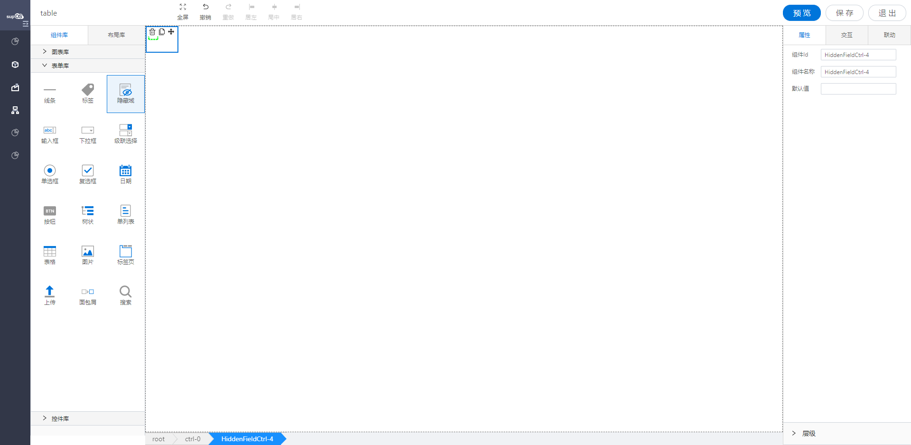

<h2>隐藏域</h2>

---

**1\. 基本信息**

{.img-fluid tag=1}

#### **组件简介**

> 名称：隐藏域
>
> 功能：用于不显示的数据，做数据传递
>
> 使用场景：页面不需要显示但是有用的数据可使用

#### **属性配置**

| 属性     | 描述信息         | 类型   | 默认值 | 设值方法            | 取值方法            |
| -------- | ---------------- | ------ | ------ | ------------------- | ------------------- |
| 组件Id   | 组件Id           | string | \-     |                     |                     |
| 组件名称 | 控件的赋值标识符 | string | \-     | setFormItemId\(\)   | getFormItemId\(\)   |
| 默认值   | 设置隐藏域默认值 | string | ‘’     | setDefaultValue\(\) | getDefaultValue\(\) |

#### **联动配置**

| 类型     | 方法               | 描述               | 返回数据\(作为源\)         | 方法赋值（作为目标） |
| -------- | ------------------ | ------------------ | -------------------------- | -------------------- |
| 作为源   | 初始化             | 初始化设置值的时候 | 通过任意方式设置初始化的值 |                      |
| 值改变   | 值改变之后值的改变 | 值改变之后 的值    |                            |
| 作为目标 | 设置值             | 设置该控件的值     |                            | 设置该控件的值       |

#### **示例代码**


##### 获取控件默认值
```javascript
  instance.getDefaultValue();
```

##### 设置控件值
```javascript
 var Hidden = instance; // 或者 window.supQuery.getInstanceById('htDiv72');
// 字符串
Hidden.setValue("1");
// 布尔类型
Hidden.setValue(true);
// 对象
Hidden.setValue({name: 1});
```