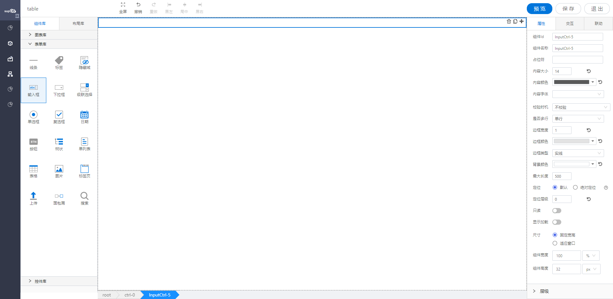

<h2>输入框</h2>

---

**1\. 基本信息**

{.img-fluid tag=1}

#### **组件简介**

> 名称：输入框
>
> 功能：用于用户输入
>
> 使用场景：

#### **属性配置**

| 属性     | 描述信息                                                 | 类型                                                                                                | 默认值                         | 设值方法                         | 取值方法                        |
| -------- | -------------------------------------------------------- | --------------------------------------------------------------------------------------------------- | ------------------------------ | -------------------------------- | ------------------------------- |
| 组件id   | 该控件唯一标识，                                         |                                                                                                     |                                |                                  |
| 组件名称 | 控件的组件名称，用于联动key和表单提交                    |                                                                                                     | setFormItemId\(string\)        | getFormItemId\(\)                |
| 占位符   | 输入框中的占位符提示                                     | ''                                                                                                  | setPlaceHolder\(string\)       | getPlaceHolder\(\)               |
| 内容大小 | 内容的字体大小                                           | 14                                                                                                  | setContextFontSize\(number\)   | getContextFontSize\(number\)     |
| 内容颜色 | 内容颜色                                                 | \#000000                                                                                            | setContextColor\(string\)      | getContextColor\(\)              |
| 内容字体 | 内容字体设置                                             | ''                                                                                                  | setContextFontFamily\(string\) | getContextFontFamily\(\)         |
| 校验时机 | 运行期是否对控件输入框内进行校验或者选择什么时机进行检验 | 'never' / 'Change' /'Blur'                                                                          | 'never'                        | setValidityCheck\(object\)       | getValidityCheck\(\).checkTime  |
| 是否必填 | 运行期控件输入框内内容是否必填                           | 'false'                                                                                             | setValidityCheck\(object\)     | getValidityCheck\(\)\.isRequired |
| 格式     | 校验格式                                                 | 'none' / 'mobilePhone' / 'telephone' /'zipCode' / 'idCard' / 'number' / 'email' /  'ip' /  'custom' | ‘none’                         | setValidityCheck\(object\)       | getValidityCheck\(\)\.customReg |
| 是否多行 | 输入框是否支持多行                                       | 'no'                                                                                                | setIsMultipleLine\(string\)    | getIsMultipleLine\(\)            |
| 边框宽度 | 搜索框边框宽度                                           | 1                                                                                                   | setBorderWidth\(number\)       | getBorderWidth\(\)               |
| 边框颜色 | 搜索框边框颜色                                           | \#fff                                                                                               | setBorderColor\(string\)       | getBorderColor\(\)               |
| 边框类型 | 搜索框边框类型                                           | 'solid'                                                                                             | setBorderStyle\(string\)       | getBorderStyle\(\)               |
| 背景颜色 | 搜索框背景颜色                                           | \#fff                                                                                               | setBackgroundColor\(\)         | getBackgroundColor\(\)           |
| 最大长度 | 输入框内可输入的文本最大长度                             | 500                                                                                                 | setMaxLength\(number\)         | getMaxLength\(\)                 |
| 只读     | 表单控件的只读选项                                       | boolean                                                                                             | false                          | setReadOnly\(boolean\)           | getReadOnly\(\)                 |
| 显示加载 | 运行期是否显示加载动画                                   | boolean                                                                                             | false                          | setIsShowLoading\(boolean\)      | getIsShowLoading\(\)            |

#### **公共属性配置**： [定位/尺寸/组件宽高设置](../../../CommonIntro/commonProp.md)

#### **公共交互配置**： [交互配置](../../../CommonIntro/action.md)

#### **公共联动配置**： [联动](../../../CommonIntro/link.md)

#### **联动配置**

| 类型     | 方法     | 描述               | 返回数据\(作为源\)         | 方法赋值（作为目标） |
| -------- | -------- | ------------------ | -------------------------- | -------------------- |
| 作为源   | 初始化   | 初始化设置值的时候 | 通过任意方式设置初始化的值 |                      |
| 作为源   | 值改变   | 值改变之后值的改变 | 值改变之后 的值            |                      |
| 作为源   | 失去焦点 | 失去焦点的时候     | 失去焦点 的值              |                      |
| 作为目标 | 设置值   | 设置该控件的值     |                            | 设置该控件的值       |


#### **示例代码**

##### 获取控件虚拟DOM：
```javascript
var inputCtrl = instance; // 或者 window.supQuery.getInstanceById('XXX')

```

##### 获取控件值：
```javascript
instance.getValue();

```

##### 设置控件值：
```javascript
instance.setValue('XXXX');

```
