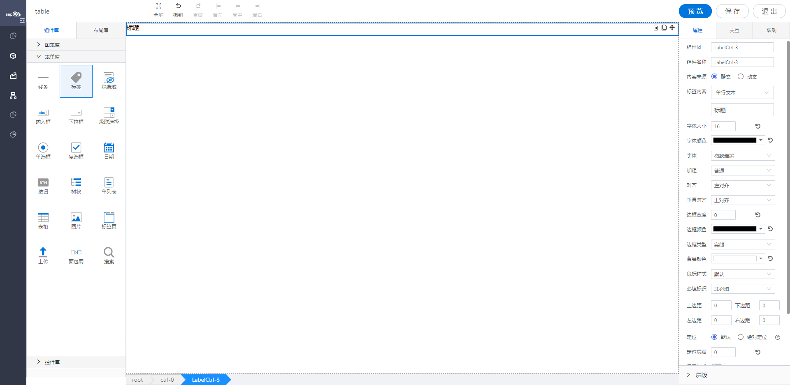

<h2>标签</h2>

---

**1\. 基本信息**

{.img-fluid tag=1}

#### **组件简介**

> 名称：标签
>
> 功能：用于标题 展示静态或者动态文本的展示
>
> 使用场景：用于标题 展示静态或者动态文本的展示

#### **属性配置**

| 属性     | 描述                                         | 类型                                                            | 默认值   | 设值方法                     | 取值方法                             |
| -------- | -------------------------------------------- | --------------------------------------------------------------- | -------- | ---------------------------- | ------------------------------------ |
| 组件id   | 该控件唯一标识，                             |                                                                 |          |                              |                                      |
| 组件名称 | 控件的组件名称，用于联动key和表单提交        |                                                                 |          |                              |                                      |
| 内容来源 | 显示的内容的来源是静态还是动态文件           | 'hand' / 'select'                                               | 'hand'   | setValueConfig\(object\)     | getValueConfig\(\)\.source           |
| 标签内容 | 静态数据的时候，配置静态数据，可配置文本格式 | 'input' / 'textarea'                                            | 'input'  | setValueConfig\(object\)     | getValueConfig\(\)\.valueType        |
| 字体大小 | 内容的 字体大小                              | number                                                          | 16       | setFontSize\(number\)        | getFontsize\(\)                      |
| 字体颜色 | 内容的 字体颜色                              | string                                                          | \#000000 | setFontColor\(string\)       | getFontColor\(\)                     |
| 字体     | 内容的 字体                                  | string                                                          | 微软雅黑 | setFontFamily\(string\)      | getFontFamily\(\)                    |
| 加粗     | 内容的 样式形式                              | 'normal' / 'bold'                                               | 普通     | setFontWeight\(string\)      | getFontWeight\(\)                    |
| 对齐     | 文字的水平对齐方式                           | 'left' / 'center' / 'right'                                     | 左对齐   | setTextAlign\(string\)       | getTextAlign\(\)                     |
| 垂直对齐 | 文字的垂直对齐方式                           | 'top' / 'middle' / 'bottom'                                     | 上对齐   | setVerticalAlign\(string\)   | getVerticalAlign\(\)                 |
| 边框宽度 | 搜索框边框宽度                               | number                                                          | 0        | setBorderWidth\(number\)     | getBorderWidth\(\)                   |
| 边框颜色 | 搜索框边框颜色                               | string                                                          | \#000000 | setBorderColor\(string\)     | getBorderColor\(\)                   |
| 边框类型 | 搜索框边框类型                               | 'solid' / 'dotted'/ 'dashed'                                    | 实线     | setBorderStyle\(string\)     | getBorderStyle\(\)                   |
| 背景颜色 | 搜索框背景颜色                               | string                                                          | \#ffffff | setBackgroundColor\(string\) | getBackgroundColor\(\)               |
| 鼠标样式 | 鼠标hover上去的样式                          | 'auto' / 'crosshair' /  'pointer' /  'move' /  'text' /  'help' | auto     | setCursor\(string\)          | getCursor\(\)                        |
| 必填标识 | 是否有必填样式                               | 'no' / 'yes'                                                    | 不必填   | setIsRequired\(string\)      | getIsRequired\(\)                    |
| 上边距   | 上边距                                       | number                                                          | 0        | setBaseBoxSpacing\(object\)  | getBaseBoxSpacing\(\)\.spacingTop    |
| 下边距   | 下边距                                       | number                                                          | 0        | setBaseBoxSpacing\(object\)  | getBaseBoxSpacing\(\)\.spacingBottom |
| 左边距   | 右边距                                       | number                                                          | 0        | setBaseBoxSpacing\(object\)  | getBaseBoxSpacing\(\)\.spacingLeft   |
| 右边距   | 右边距                                       | number                                                          | 0        | setBaseBoxSpacing\(object\)  | getBaseBoxSpacing\(\)\.spacingRight  |


#### **公共属性配置**： [定位/尺寸/组件宽高设置](../../../CommonIntro/commonProp.md)

#### **公共交互配置**： [交互配置](../../../CommonIntro/action.md)

#### **公共联动配置**： [联动](../../../CommonIntro/link.md)

#### **联动配置**
| 类型     | 方法   | 返回数据\(作为源\)/ 方法赋值（作为目标） | 描述               |
| -------- | ------ | ---------------------------------------- | ------------------ |
| 作为源   | 初始化 | 通过任意方式设置初始化的值               | 初始化设置值的时候 |
| 作为目标 | 设置值 | 设置该控件的值                           | 设置该控件的值     |


#### **示例代码**

### 设置值
```
var label = instance;
instance.setValue('labelValue');
```
