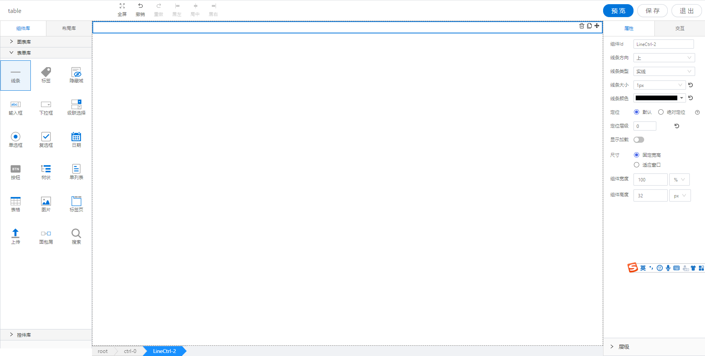

<h2>线条</h2>

---

**1\. 基本信息**

{.img-fluid tag=1}

#### **组件简介**

> 名称：线条
>
> 功能：用于分格
>
> 使用场景：分格

#### **属性配置**

| 属性     | 描述                                           | 类型                                     | 默认值  | 设值方法               | 取值方法         |
| -------- | ---------------------------------------------- | ---------------------------------------- | ------- | ---------------------- | ---------------- |
| 组件Id   | 控件的id                                       | string                                   |         |                        |                  |
| 线条方向 | 控制线条显示方向，选项：上、下、左、右         | 'top' / 'right' / 'bottom' / 'left'      | 'top'   | setDirection\(string\) | getDirection\(\) |
| 线条类型 | 设置线条的类型，选项：实线、点线、虚线、双实线 | 'solid' / 'dotted' / 'dashed' / 'double' | 'solid' | setLineStyle\(string\) | getLineStyle\(\) |
| 线条大小 | 设置线条的粗细                                 | number                                   | 1       | setSize\(number\)      | getSize\(\)      |
| 线条颜色 | 设置线条颜色                                   | string                                   | \#000   | setLineColor\(string\) | getLineColor\(\) |

#### **公共属性配置**： [定位/尺寸/组件宽高设置](../../../CommonIntro/commonProp.md)

#### **公共交互配置**： [交互配置](../../../CommonIntro/action.md)

