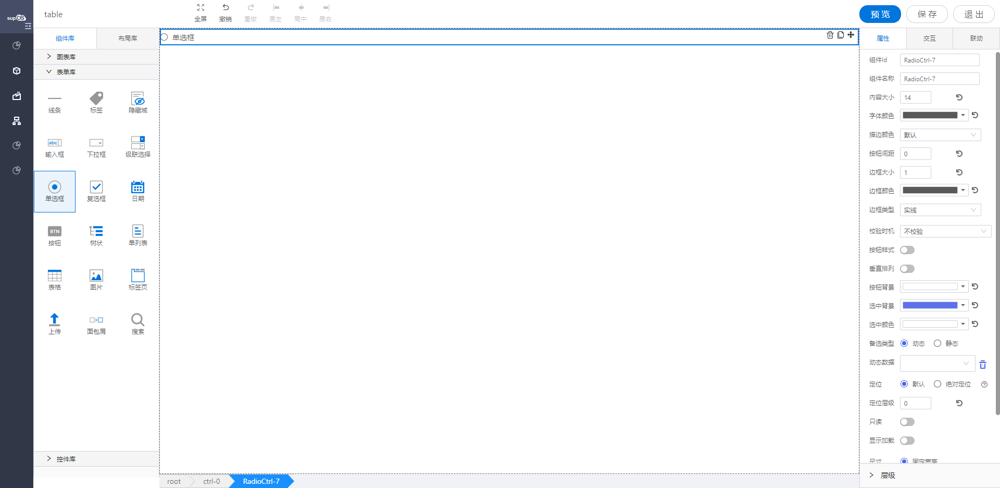

<h2>单选框</h2>

---

**1\. 基本信息**

{.img-fluid tag=1}

#### **组件简介**

> 名称：单选框
>
> 功能：用于用户单选使用
>
> 使用场景：

#### **属性配置**

| 属性     | 描述信息                    | 类型              | 默认值    | 设值方法             | 取值方法                             |
| -------- | --------------------------| ---------------- | -------- | ------------------- | ------------------------------------ |
| 组件id   | 该控件唯一标识，              |                  |          |                     |                                      |
| 组件名称 | 控件的组件名称，用于联动key和表单提交      | Object  |          | setFormItemId\({value:String}\)             | getFormItemId\(\).value                    |
| 内容文本 | 下拉框框内内容的大小/颜色/字体    | Object  | 14 /  'rgba\(0, 0, 0, 0\.65\)' /  微软雅黑 | setContextText\({fontSize: number, color: string, fontFamily: string}\) |getContextText\(\)  |
| 校验时机 | 运行期是否对控件输入框内进行校验或者选择什么时机进行检验 | object        |          | setValidityCheck\(object\)          | getValidityCheck\(\)                 |
| 是否必填 | 运行期控件输入框内内容是否必填              | ’true‘ / ’false‘       | ’false‘  | setValidityCheck\(object\)          | getValidityCheck\(\)\.isRequired     |
| 垂直排列 | 垂直排列                                 | Object      | false    | setCutLine\({value:boolean}\)                      | getCutLine\(\).value                       |
| 备选类型 | 下拉选项类型                              | object        |          | setDataSource\(object\)             | getDataSource\(\)\.type              |
| 动态数据 | 通过对象选择器绑定动态数据渲染下拉选项        | object         |          | setDataSource\(object\)             | getDataSource\(\)\.staticDataSource  |
| 静态数据 | 手动添加数据渲染下拉选项                    | object        |          | setDataSource\(object\)             | getDataSource\(\)\.dynamicDataSource |
| 只读     | 表单控件的只读选项                        | Object      | false    | setReadOnly\({value:boolean}\)              | getReadOnly\(\).value                      |
| 显示加载 | 运行期是否显示加载动画                     | Object       | false    | setIsShowLoading\({value:boolean}\)         | getIsShowLoading\(\).value                 |

#### **属性配置-按钮配置**
| 属性     | 描述信息                    | 类型      | 默认值    | 设值方法             | 取值方法                             |
| -------- | --------------------------| ---------| -------- | ------------------- | ------------------------------------ |
| 按钮样式 | 设置选项为 常规/按钮           | Object   | 常规：false; 按钮: true    | setRadioTypeConfig\({buttonType:boolean}\)    | getRadioTypeConfig\(\).buttonType      |
| 按钮间距 | 按钮: 按钮样式的时候 中间的间距  | Object   |          | setRadioTypeConfig\({buttonMargin:number}\)           | getRadioTypeConfig\(\).buttonMargin                  |
| 按钮背景 | 按钮: 按钮背景颜色             | Object   | \#fff    | setRadioTypeConfig\({buttonBackground:String}\)       | getRadioTypeConfig\(\).buttonBackground              |
| 选中背景 | 按钮: 选中选项后按钮的背景色    | string   | \#5E71E9 | setRadioTypeConfig\({buttonSelectBackground:String}\) | getRadioTypeConfig\(\).buttonSelectBackground        |
| 选中颜色 | 按钮: 选中选项后按钮的字体颜色   | string   | \#fff    | setRadioTypeConfig\({buttonSelectColor:String}\)      | getRadioTypeConfig\(\).buttonSelectColor             |
| 边框大小 | 按钮: 按钮边框的大小           | Object   |          | setRadioTypeConfig\({buttonSelectColor:number}\)      | getRadioTypeConfig\(\).buttonSelectColor             |
| 边框颜色 | 按钮: 按钮边框的颜色           | Object   |          | setRadioTypeConfig\({buttonBorderColor:string}\)      | getRadioTypeConfig\(\).buttonBorderColor             |
| 边框类型 | 按钮: 边框类型的  | {value: 'solid' / 'dotted' / 'dashed'} | 'solid'  | setRadioTypeConfig\({buttonBorderStyle:String}\) | getRadioTypeConfig\(\).buttonBorderStyle  |
| 描边颜色 | 常规:按钮样式为常规的时候配置    | Object    |          | setRadioTypeConfig\({checkedBackground:String}\)      | getRadioTypeConfig\(\).checkedBackground             |

```javascript
  // 设置成常规模式
  const RadioTypeConfig = instance.getRadioTypeConfig();
  instance.setRadioTypeConfig({
    ...RadioTypeConfig,
    buttonType: false
  });

  // 设置成按钮模式
  const RadioTypeConfig = instance.getRadioTypeConfig();
  instance.setRadioTypeConfig({
    ...RadioTypeConfig,
    buttonType: true,
    buttonMargin: 10, //按钮间距
    // 等其他
  });
```

#### **公共属性配置**： [定位/尺寸/组件宽高设置](../../../CommonIntro/commonProp.md)

#### **公共交互配置**： [交互配置](../../../CommonIntro/action.md)

#### **公共联动配置**： [联动](../../../CommonIntro/link.md)

#### **联动配置**

| 类型     | 方法     | 描述                          | 返回数据\(作为源\) | 方法赋值（作为目标） |
| -------- | -------- | ----------------------------- | ------------------ | -------------------- |
| 作为源   | 初始化   | 各种方式初始化设置值之后触发  | 初始化的值         |                      |
| 作为源   | 内容改变 | Radio选中内容发生改变之后触发 | 内容改变之后 的值  |                      |
| 作为目标 | 设置选中 | 源数据的数据设置成该Radio的值 |                    | 设置Radio的值        |
| 作为目标 | 查询     | 重新获取绑定数据源的数据      |                    | 查询数据             |


#### **联动公共配置项**
| 格式转换（作为源\-返回的数据处理） | 源字段（作为源）                                      |
| ---------------------------------- | ----------------------------------------------------- |
| 自定义                             | label ： 获取数据中的label；value ：获取数据中的value |


#### **示例代码**


#### Radio单选框控件

radio单选框选项配置方式有三种

- 动态绑定对象的属性
- 绑定静态数据源
- 通过脚本设置

##### 获取控件虚拟DOM：

```javascript
 var Checkbox = instance；
 // 或者
 var Checkbox = window.supQuery.getInstanceById('XXX');

```

##### 获取选中的值：
```javascript
  instance.getValue();
```

##### 设置选中的值：
```javascript
  instance.setValue('XX');
```